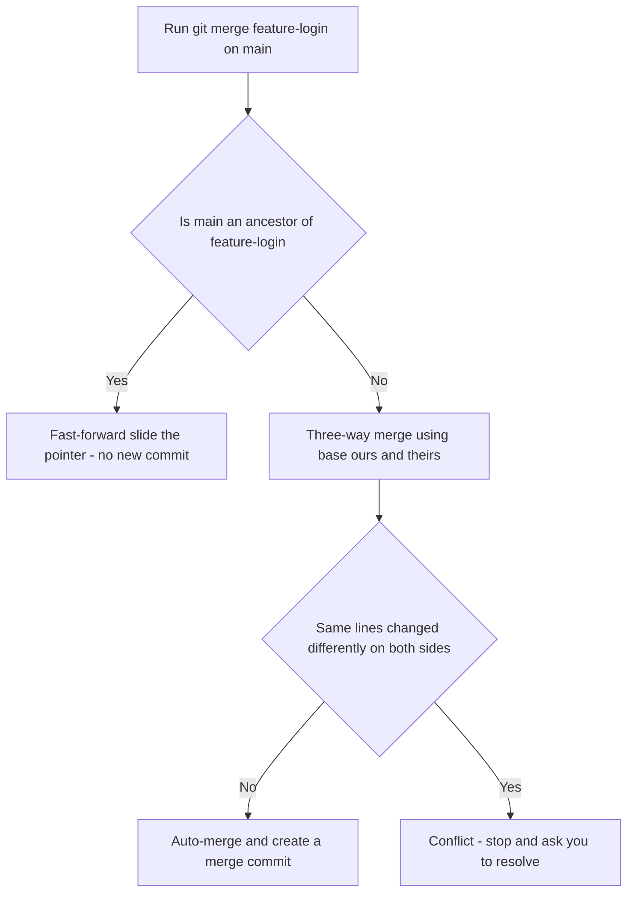
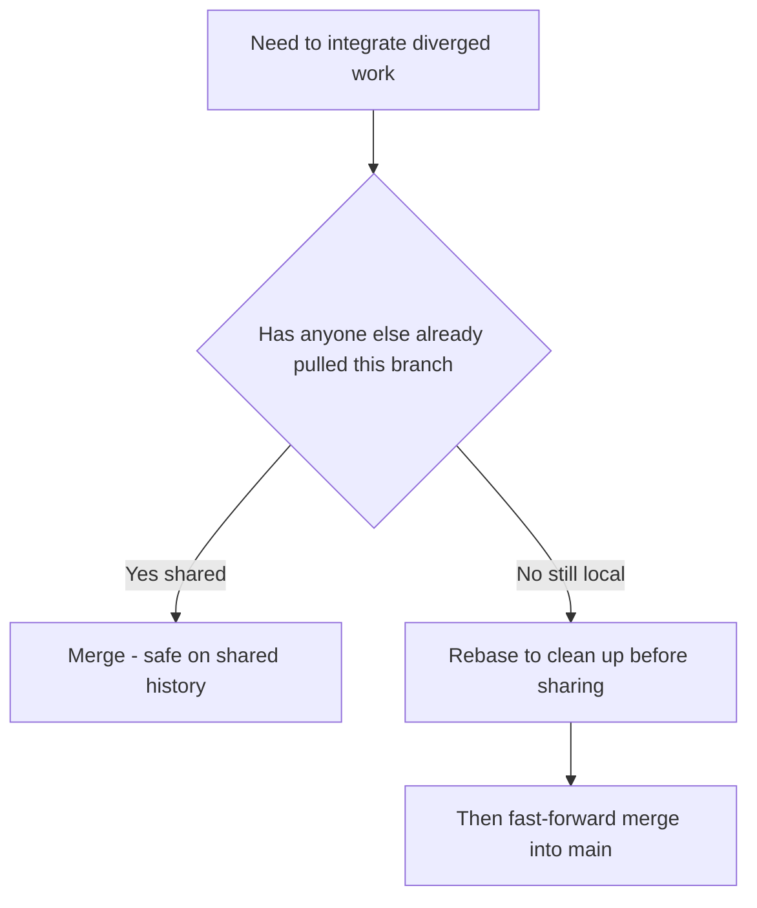

# Lecture 2 — Merging: fast-forward vs. three-way

> **Duration:** ~2 hours. **Outcome:** You can predict whether a given merge will fast-forward or create a merge commit; you can force either outcome on purpose; you can read a merge commit's two parents; and you can say — for a concrete situation — whether merge or rebase is the better tool.

## 1. What "merge" actually asks Git to do

Merging means: *take the work on branch B and combine it into branch A.* You run it while sitting on the branch that should **receive** the work:

```bash
git switch main            # be on the branch that RECEIVES the changes
git merge feature-login    # bring feature-login's commits INTO main
```

The direction matters and trips people up constantly. `git merge feature-login` **while on `main`** updates `main`. It does *not* touch `feature-login`. Say it to yourself: "I am on the destination; I name the source."

How Git combines the two depends entirely on the *shape* of the history between them. There are two shapes, and therefore two kinds of merge.

## 2. Fast-forward: when there's nothing to actually merge

Suppose you branched `feature-login` off `main`, added two commits, and **`main` never moved** in the meantime:

```
        C ── D   (feature-login)
       /
A ── B           (main)
```

`main` points at `B`. `feature-login` points at `D`. `B` is an ancestor of `D` — the history is a straight line, no divergence. To "merge" here, Git doesn't need to combine anything. It just slides the `main` pointer forward from `B` to `D`. That's a **fast-forward**:

```
A ── B ── C ── D   (main, feature-login)
```

```bash
git switch main
git merge feature-login
# Updating 9f4c2b1..a1b2c3d
# Fast-forward
#  auth.py | 1 +
#  1 file changed, 1 insertion(+)
```

Key facts about a fast-forward:

- **No new commit is created.** `main` simply now points at the same commit `feature-login` does.
- The history stays perfectly linear — as if the feature work had been done on `main` all along.
- It's only *possible* when the destination branch is a direct ancestor of the source (the destination hasn't advanced since you branched).

## 3. Three-way merge: when both branches moved

Now the realistic case. You branched `feature-login` off `main`, but while you worked, someone (or you) also committed to `main`:

```
        C ── D        (feature-login)
       /
A ── B ── E ── F      (main)
```

History has **diverged**. `main` is at `F`, `feature-login` is at `D`, and neither is an ancestor of the other. You cannot fast-forward — sliding a pointer would abandon commits. Git must genuinely combine the two lines, and it does so with a **three-way merge**.

Why "three-way"? Because Git looks at **three** commits, not two:

| Role | Commit | What it is |
|------|--------|------------|
| **ours** | `F` | tip of the branch you're on (`main`) |
| **theirs** | `D` | tip of the branch you're merging in |
| **base** (merge base) | `B` | the most recent **common ancestor** of both |

Git finds the merge base automatically with an algorithm equivalent to `git merge-base main feature-login`. It then computes two diffs — base→ours and base→theirs — and combines them. For any given hunk:

- Changed on **only one** side → take that side's version, automatically.
- Changed on **both** sides, identically → take it, automatically.
- Changed on **both** sides, differently → **conflict** (that's Lecture 3).

If nothing conflicts, Git creates a brand-new commit — a **merge commit** — with **two parents**: `F` and `D`.

```
        C ── D           (feature-login)
       /       \
A ── B ── E ── F ── M     (main)
```

`M` is the merge commit. It records the combined snapshot and points back at *both* `F` and `D`, permanently recording that these two lines of history joined here.

```bash
git switch main
git merge feature-login
# Merge made by the 'ort' strategy.
#  auth.py | 1 +
#  1 file changed, 1 insertion(+)
```

Git opens your editor to write the merge commit's message (default: `Merge branch 'feature-login'`). Keep it or improve it. That editor step is your cue: *a merge commit is being created; this was a three-way merge.*

> **The base is why merging is smart.** Without a common ancestor, Git couldn't tell an *addition* from a *deletion* — it would only see two different files and force you to reconcile everything by hand. The merge base turns "two versions" into "who changed what, relative to a shared starting point."


*Whether a merge fast-forwards or creates a merge commit depends entirely on whether the branches diverged.*

## 4. Inspecting a merge commit

A merge commit is a normal commit with one unusual property: **two (or more) parents**. Prove it:

```bash
git cat-file -p HEAD
# tree   4b825dc642cb6eb9a060e54bf8d69288fbee4904
# parent f6a5b4c3d2e1f0a9b8c7d6e5f4a3b2c1d0e9f8a7   <- 'ours' (main before merge)
# parent a1b2c3d4e5f6a7b8c9d0e1f2a3b4c5d6e7f8a9b0   <- 'theirs' (feature-login)
# author  …
# committer …
#
# Merge branch 'feature-login'
```

Two `parent` lines. That's the signature of a merge. Useful views:

```bash
git log --merges                 # show only merge commits
git log --no-merges              # hide merge commits (just the real work)
git show HEAD                     # the combined diff the merge introduced
git log --oneline --graph        # SEE the two lines rejoin
```

The first parent (listed first) is always the branch you were **on** when you merged — "ours." That ordering matters later: `HEAD^1` is the first parent (main's line), `HEAD^2` is the second (the merged-in branch).

## 5. Forcing the outcome you want

You are not at the mercy of history shape. Two flags let you override the default.

### Force a merge commit even when a fast-forward is possible: `--no-ff`

```bash
git switch main
git merge --no-ff feature-login
```

Even if `main` could fast-forward, `--no-ff` creates a merge commit anyway. Why would you want the "extra" commit?

- It **records that a feature existed** as a unit. `git log --first-parent` then reads as a clean list of features merged, not a flat stream of individual commits.
- It makes the whole feature **revertible in one move**: `git revert -m 1 <merge>` backs out the entire feature.
- Many teams enable it on `main` for exactly these reasons (GitHub's "Create a merge commit" option does this).

### Force a fast-forward, refusing to merge otherwise: `--ff-only`

```bash
git merge --ff-only feature-login
# fatal: Not possible to fast-forward, aborting.   (if histories diverged)
```

`--ff-only` says "only proceed if you can fast-forward; otherwise stop and let me decide." Teams that want a strictly linear history (no merge commits) use this, usually combined with rebasing first. It's a guardrail: it fails loudly instead of silently creating a merge commit you didn't want.

Here's the decision compactly:

| You run | Histories linear (can FF) | Histories diverged |
|---------|---------------------------|--------------------|
| `git merge X` (default) | fast-forward, no new commit | three-way, merge commit |
| `git merge --no-ff X` | merge commit anyway | merge commit |
| `git merge --ff-only X` | fast-forward, no new commit | **aborts** with an error |

## 6. When to merge vs. rebase (a preview)

You'll meet `rebase` properly in Week 4, but the *decision* belongs here, next to merging, because they're the two answers to the same question: "how do I integrate diverged work?"

- **Merge** preserves history exactly as it happened. Diverged lines stay diverged and are joined by a merge commit. The graph is truthful but can get busy.
- **Rebase** rewrites your branch's commits so they appear to have been built *on top of* the latest destination — replaying `C` and `D` onto `F` as brand-new commits `C'` and `D'`. The result is linear, as if you'd started from `F` all along. Cleaner graph, but the commits are **rewritten** (new hashes).

```
Merge result:                    Rebase-then-fast-forward result:

    C ── D                        A ── B ── E ── F ── C' ── D'   (main)
   /       \
A ─ B ─ E ─ F ─ M   (main)
```

A workable rule of thumb for now:

| Situation | Prefer |
|-----------|--------|
| Integrating a finished feature into a shared `main` | **merge** (often `--no-ff`) — it's honest and non-destructive |
| Tidying up **your own** local branch before sharing it | **rebase** — makes review easier |
| The branch is already pushed and others have it | **merge** — rebasing rewrites shared history and breaks their copies |
| The team standardized on a linear history | **rebase** locally, then `--ff-only` merge |

**The one rule you must not break:** *never rebase commits that other people have already based work on.* Rebasing changes hashes; anyone who pulled the old commits now has a divergent copy, and you've made everyone's day worse. Merging is always safe on shared branches; rebasing is only safe on private ones. Details in Week 4 — for now, when in doubt, **merge**.


*Merge is always safe on shared branches; rebase is only safe while the branch is still private.*

## 7. Aborting and octopus merges (brief)

If a merge starts and you decide you don't want it — before or during conflict resolution — back all the way out:

```bash
git merge --abort        # restore the pre-merge state exactly
```

Git can also merge **more than two** branches at once (an "octopus" merge, the default strategy for 3+ branches with no conflicts):

```bash
git merge featА featВ featС
```

Octopus merges are neat but only work when none of the branches conflict; the moment they do, you're better off merging one at a time so you can resolve deliberately. You'll do exactly that in this week's mini-project.

## 8. Check yourself

- Draw two histories: one that will fast-forward and one that will need a three-way merge. What's structurally different?
- In a three-way merge, name the three commits Git looks at and what each is called.
- How many parents does a merge commit have? How do you list them?
- What does `--no-ff` buy you that a plain fast-forward doesn't?
- Give one situation where you'd merge and one where you'd rebase — and the rule that forbids rebasing.
- After `git merge --ff-only X` fails, what does that failure tell you about the histories?

## Further reading

- **Pro Git — "Basic Branching and Merging":** <https://git-scm.com/book/en/v2/Git-Branching-Basic-Branching-and-Merging>
- **Pro Git — "Rebasing":** <https://git-scm.com/book/en/v2/Git-Branching-Rebasing>
- **`git merge` documentation:** <https://git-scm.com/docs/git-merge>
- **Atlassian — Merging vs. Rebasing:** <https://www.atlassian.com/git/tutorials/merging-vs-rebasing>
