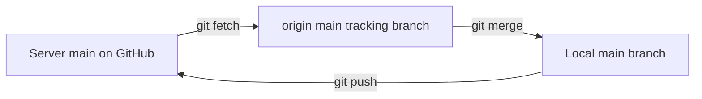

# Lecture 1 — Remotes, `origin`, and the fetch/pull distinction

> **Duration:** ~2 hours. **Outcome:** You can explain what a remote *is* (a name bound to a URL plus a set of remote-tracking branches), describe exactly what `git clone` sets up, and choose between `git fetch` and `git pull` on purpose rather than out of habit.

## 1. Why "remote" is a boring word for a powerful idea

For two weeks your repository has been an island. Every object — every blob, tree, and commit — lived in `.git/` on one disk. That's fine until it isn't: a dead laptop, a teammate who needs your branch, or an open-source project you want to contribute to. All three problems have one answer: **give your history somewhere else to live, and a way to move objects back and forth.**

A **remote** is Git's name for "another copy of this repository, reachable at some URL." That's the whole idea. What makes it useful is that Git does not blindly copy files — it moves *objects* by hash, sends only what the other side is missing, and never silently overwrites history. Understanding the machinery below turns "why won't it push?" from a mystery into a two-line diagnosis.

The key mental model for this lecture:

> A remote is **a short name** (like `origin`) **+ a URL** (where to reach it) **+ remote-tracking branches** (Git's cached snapshot of what that URL looked like the last time you talked to it).

Hold onto the phrase "the last time you talked to it." Almost every confusing thing about remotes comes from forgetting that your local view of the server can be stale.

## 2. Listing and inspecting remotes

Every remote has a name and one or two URLs (a fetch URL and a push URL, usually identical).

```bash
git remote                 # just the names, e.g. "origin"
git remote -v              # names + URLs (v = verbose)
git remote show origin     # a full report: URLs, branches, tracking status
```

`git remote -v` prints something like:

```
origin  https://github.com/octocat/Hello-World.git (fetch)
origin  https://github.com/octocat/Hello-World.git (push)
```

Two lines, same URL — one for downloading, one for uploading. They *can* differ (some workflows fetch from one place and push to another), but for now treat them as a pair.

Where does this live? In plain text, inside your repo:

```bash
git config --get-regexp '^remote\.'
```

Or look directly at `.git/config`:

```ini
[remote "origin"]
    url = https://github.com/octocat/Hello-World.git
    fetch = +refs/heads/*:refs/remotes/origin/*
```

That `fetch = ...` line is a **refspec**. Read it as: "when I fetch, copy every branch on the server (`refs/heads/*`) into my remote-tracking namespace (`refs/remotes/origin/*`)." You almost never write refspecs by hand, but knowing they exist demystifies the whole system.

## 3. Why `origin`? (It's just a default, not a keyword)

`origin` is **not** a reserved word. It's the conventional name Git gives to the remote you cloned from, because that URL is the *origin* of your copy. You can rename it, delete it, or have five remotes with any names you like:

```bash
git remote rename origin upstream    # rename it
git remote add backup git@example.com:me/repo.git   # add another
git remote remove backup             # remove one
```

Two names you'll meet constantly this week:

| Name | Convention | Points at |
|------|-----------|-----------|
| `origin` | The remote you cloned from — usually *your* copy | Your repo on the server (or your fork) |
| `upstream` | The *original* project you forked from | Someone else's canonical repo |

We'll wire up `upstream` in Lecture 3. For now, just know `origin` earns no special powers from its name.

## 4. `git clone`, decomposed

You've probably run `git clone` already. Let's see exactly what it does, because it quietly performs five steps:

```bash
git clone https://github.com/octocat/Hello-World.git
```

1. **Creates a directory** (`Hello-World/`) and runs `git init` inside it.
2. **Adds a remote** named `origin` pointing at that URL.
3. **Fetches all objects** from the server — every commit, tree, and blob.
4. **Creates remote-tracking branches** for each server branch: `origin/main`, `origin/dev`, etc.
5. **Checks out** the default branch, creating a *local* `main` that tracks `origin/main`.

So `git clone URL` is roughly equivalent to:

```bash
mkdir Hello-World && cd Hello-World
git init
git remote add origin https://github.com/octocat/Hello-World.git
git fetch origin
git switch -c main --track origin/main
```

Nobody types that by hand — but seeing it spelled out explains why, right after a clone, `git branch -a` shows both a local `main` and an `origin/main`, and why `git status` immediately knows whether you're up to date.

Useful clone variations:

| Command | Effect |
|---------|--------|
| `git clone URL myname` | Clone into a directory called `myname` instead of the repo's name |
| `git clone --depth 1 URL` | **Shallow** clone — only the latest commit. Fast, small, but limited history |
| `git clone --branch dev URL` | Check out `dev` instead of the default branch |
| `git clone --bare URL` | No working tree — used for servers and mirrors, not daily work |

## 5. Remote-tracking branches: the thing everyone skips

This is the single most important concept in the lecture, so slow down.

There are **three** different pointers in play, and confusing them causes most remote headaches:

| Pointer | Example | What it is |
|---------|---------|-----------|
| **Local branch** | `main` | The branch you commit to. Moves when *you* commit. |
| **Remote-tracking branch** | `origin/main` | Git's read-only cache of where `main` was on the server *last time you fetched*. |
| **The actual server branch** | `main` on GitHub | The real thing. You can't see it change until you contact the server. |

`origin/main` is a local, read-only pointer. You cannot check it out and commit to it. It only moves when you run `git fetch` (or `git pull`, which fetches first). This is *by design*: it gives Git a stable "known good" reference to compare your work against.


*Fetch updates the read-only tracking branch; merge moves those commits onto your local branch; push sends yours back to the server.*

That comparison is what produces messages like:

```
Your branch is ahead of 'origin/main' by 2 commits.
```

Git computed that by counting commits between your local `main` and its cached `origin/main`. If someone pushed to the server five minutes ago and you haven't fetched, `origin/main` is stale — and Git will happily tell you you're "up to date" when you're not. **The status is only as fresh as your last fetch.**

See all three with:

```bash
git branch -a        # local + remote-tracking branches (remotes shown in red/remotes/*)
git branch -vv       # each local branch + which remote branch it tracks + ahead/behind
```

`git branch -vv` output is worth memorizing:

```
* main  a1b2c3d [origin/main: ahead 2] add push section
  dev   e4f5g6h [origin/dev]
```

`[origin/main: ahead 2]` means: `main` tracks `origin/main`, and you have 2 local commits the server hasn't seen.

## 6. `git fetch` — download, change nothing local

`git fetch` contacts the remote, downloads any new objects, and **updates your remote-tracking branches** (`origin/*`). It does **not** touch your working tree or your local branches. Nothing you're editing changes. It is the safest command in Git — you can run it any time, on any branch, with uncommitted work, and nothing breaks.

```bash
git fetch origin           # update all origin/* tracking branches
git fetch                  # same, using the default remote
git fetch origin main      # update just origin/main
```

After a fetch, *you* decide what to do with the new commits:

```bash
git log main..origin/main          # what's on the server that I don't have?
git log origin/main..main          # what do I have that the server doesn't?
git diff main origin/main          # show the actual differences
```

Then, when ready, integrate them yourself:

```bash
git merge origin/main              # merge the fetched commits into current branch
# or
git rebase origin/main             # replay your work on top (Week 4 topic)
```

The pattern **`fetch`, look, then integrate** is the professional's default. It never surprises you.

## 7. `git pull` — fetch *and* integrate in one step

`git pull` is a convenience that does two things back to back:

```bash
git pull origin main
# is (by default) equivalent to:
git fetch origin
git merge origin/main
```

So `pull` = `fetch` + `merge`. That's it. It's not a separate mechanism — it's two commands stapled together. The staple is convenient and occasionally surprising: `pull` can create a merge commit or drop you into a conflict the instant you run it, before you've had a chance to look at what's incoming.

You can change the integration step from merge to rebase:

```bash
git pull --rebase origin main      # fetch, then rebase your commits on top
```

Or set a default so you never have to remember:

```bash
git config --global pull.rebase false   # always merge (the classic default)
git config --global pull.rebase true    # always rebase (linear history)
git config --global pull.ff only        # refuse to pull unless it's a clean fast-forward
```

`pull.ff only` is a great safety setting for beginners: if the pull *can't* be a simple fast-forward, Git stops and makes you choose merge or rebase explicitly, instead of silently doing something.

### fetch vs. pull — the decision table

| You want to… | Use | Why |
|--------------|-----|-----|
| See what's new on the server without changing your files | `git fetch` | Read-only to your working tree |
| Update `origin/*` before a big decision | `git fetch` | Refreshes the comparison baseline |
| Grab the latest and integrate it into your branch right now | `git pull` | fetch + merge in one |
| Grab the latest but keep a linear history | `git pull --rebase` | fetch + rebase |
| Never be surprised by a merge commit | `git fetch`, inspect, then merge | Full control |

**Rule of thumb:** when in doubt, `fetch` first. `pull` is `fetch` with the "and integrate immediately" decision already made for you.

## 8. A tiny end-to-end demo (no server required)

You can practice remotes entirely offline using a local "bare" repo as the server. A **bare** repository has no working tree — it's the shape a real server uses.

```bash
# 1. Make a "server" — a bare repo, the kind GitHub hosts for you
mkdir -p ~/c31-w3/demo && cd ~/c31-w3/demo
git init --bare server.git

# 2. Clone it as if it were on GitHub
git clone ./server.git work
cd work

# 3. It's empty; make history and push it
echo "# Demo" > README.md
git add README.md
git commit -m "First commit"
git push origin main            # main now exists on the "server"

# 4. Inspect the remote wiring
git remote -v
git branch -vv                  # main tracks origin/main
git log --oneline --decorate    # note the (origin/main) tag next to your commit
```

Now simulate a *teammate* pushing, so you can watch `fetch` vs `pull` in action:

```bash
cd ~/c31-w3/demo
git clone ./server.git teammate
cd teammate
echo "A teammate's line" >> README.md
git commit -am "Teammate change"
git push origin main            # server is now ahead of your first clone

cd ~/c31-w3/demo/work
git status                      # still says "up to date" — origin/main is STALE
git fetch                       # now origin/main moves
git status                      # NOW it says "behind by 1 commit"
git log --oneline main..origin/main   # see exactly what the teammate added
git pull                        # integrate it (fast-forward)
```

That sequence — stale status, `fetch` to refresh, `pull` to integrate — is the heartbeat of every collaborative Git workflow. Everything else this week is variations on it.

## 9. Common confusions, cleared up

- **"I `git pull`ed and it made a weird merge commit."** `pull` defaulted to merge and your branch had diverged from the server. Use `--rebase` or set `pull.ff only`.
- **"`git status` says up to date but the website shows new commits."** Your `origin/main` is stale. Run `git fetch`.
- **"I can't check out `origin/main`."** Correct — it's read-only. Create a local branch from it: `git switch -c main --track origin/main`.
- **"`git push` says everything up-to-date but I just committed."** You committed on a different branch than the one tracking the remote. Check `git branch -vv`.

## 10. Check yourself

- What three things make up a remote?
- Name the five steps `git clone` performs.
- What is the difference between `main`, `origin/main`, and the branch called `main` on the server?
- Why can't you commit directly onto `origin/main`?
- Precisely, `git pull` is equal to which two commands?
- Your `git status` says "up to date" but a teammate insists they pushed. What one command do you run to find out who's right?

If you can answer all six without notes, move to Lecture 2.

## Further reading

- **Pro Git — "Working with Remotes":** <https://git-scm.com/book/en/v2/Git-Basics-Working-with-Remotes>
- **Pro Git — "Remote Branches":** <https://git-scm.com/book/en/v2/Git-Branching-Remote-Branches>
- **`git fetch` reference:** <https://git-scm.com/docs/git-fetch>
- **`git pull` reference:** <https://git-scm.com/docs/git-pull>
