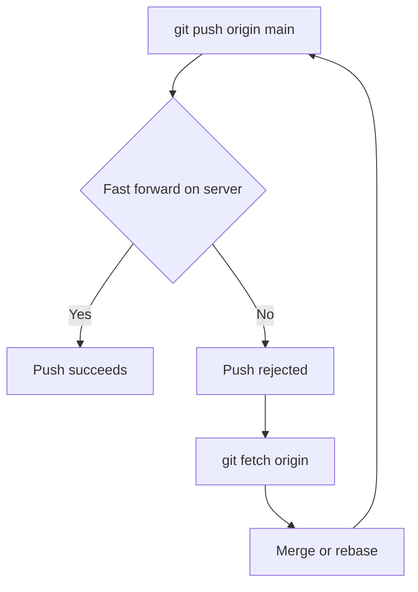

# Lecture 2 — Pushing, upstream tracking, and GitHub

> **Duration:** ~2 hours. **Outcome:** You can push a branch and set its upstream so future pushes and pulls need no arguments, explain the difference between HTTPS and SSH GitHub URLs, authenticate with a personal access token or an SSH key (never a plaintext password), and drive GitHub from the terminal with the `gh` CLI.

## 1. Pushing: sending your objects the other way

Lecture 1 was mostly about *receiving* (fetch/pull). Now the other direction. **`git push`** uploads the commits on your local branch to a remote and moves the server's branch pointer to match — but only if doing so doesn't lose anyone's work.

```bash
git push origin main
```

Read that as: "take my local `main`, send any commits `origin` is missing, and advance `origin`'s `main` to point at my latest commit." The general form is:

```bash
git push <remote> <local-branch>:<remote-branch>
git push origin main:main          # explicit form
git push origin main               # shorthand when the names match
```

Push only succeeds if it's a **fast-forward** — that is, if the server's branch is a direct ancestor of yours, so moving the pointer forward loses nothing. If someone else pushed in the meantime, Git *rejects* your push. That rejection is a feature, and Challenge 1 is entirely about handling it calmly. For now, the golden rule:

> A rejected push means **fetch and integrate first, then push again.** It almost never means `--force`.


*A rejected push is not an error to force past — fetch, integrate, then push again.*

## 2. Upstream tracking: pushing without arguments forever

Typing `git push origin main` every time is tedious. **Upstream tracking** links a local branch to a specific remote branch so that a bare `git push` and `git pull` just work.

Set it once with `-u` (short for `--set-upstream`):

```bash
git push -u origin main
```

From then on, on that branch:

```bash
git push        # knows to push main -> origin/main
git pull        # knows to pull origin/main -> main
git status      # can report ahead/behind against origin/main
```

Inspect what tracks what:

```bash
git branch -vv
# * main  a1b2c3d [origin/main] add auth module
```

The `[origin/main]` in brackets is the upstream. Without it, a bare `git push` on a fresh branch errors with "no upstream branch," and Git helpfully prints the exact `-u` command to fix it.

There's a config that sets upstream automatically on first push:

```bash
git config --global push.autoSetupRemote true
```

With that on, `git push` on a brand-new local branch creates the matching remote branch *and* sets tracking — no `-u` needed. Highly recommended.

### Push cheat sheet

| Command | Effect |
|---------|--------|
| `git push -u origin main` | Push and set upstream (do this once per new branch) |
| `git push` | Push current branch to its upstream |
| `git push origin feature-x` | Push a specific branch |
| `git push origin --delete feature-x` | Delete a branch **on the server** |
| `git push origin --tags` | Push tags (they don't go automatically) |
| `git push --force-with-lease` | Force push *safely* — refuses if the server moved unexpectedly (Week 4) |

Note the last one: prefer `--force-with-lease` over `--force`. Plain `--force` overwrites the server no matter what; `--force-with-lease` first checks the server is where you last saw it, protecting you from clobbering a teammate's push. We use it properly in Week 4, but learn the name now.

## 3. What GitHub actually is

GitHub is a **hosting service for Git remotes**, plus a web layer on top: issues, pull requests, code review, CI (GitHub Actions), and access control. The Git part is standard Git — you could self-host the same thing with a bare repo on any server. What you pay GitHub for (or use free) is the *collaboration layer* and the reliability of "your repo won't vanish with your laptop."

A GitHub **repository** is just a bare repo GitHub hosts for you, given a URL. Create one from the web UI (**New repository**), or from the terminal with `gh` (Section 6). Every repo has two URL flavors, and choosing between them is the next section.

## 4. HTTPS vs. SSH — two doors into the same repo

The same GitHub repository is reachable at two different URLs. They deliver identical data; they differ only in **how you prove who you are**.

| | HTTPS | SSH |
|--|-------|-----|
| URL shape | `https://github.com/octocat/Hello-World.git` | `git@github.com:octocat/Hello-World.git` |
| Auth method | Username + **personal access token** (PAT) | An **SSH key pair** |
| Port | 443 (rarely blocked by firewalls) | 22 (sometimes blocked on corporate/campus networks) |
| Setup effort | Lower — a token and a credential helper | Higher up front — generate + register a key |
| Best when | You're behind a restrictive firewall, or new to this | You push often and want zero prompts once set up |

**You do not need both.** Pick one per machine and stick with it. Beginners on locked-down networks usually start with HTTPS + token; people who push all day tend to prefer SSH. Both are fully secure. What you must *never* do is use your GitHub **account password** on the command line — GitHub removed that option in 2021 precisely because tokens and keys are safer.

## 5. Authenticating for real

### Option A — HTTPS with a personal access token (PAT)

A PAT is a long, random string that acts like a scoped, revocable password. Steps:

1. On GitHub: **Settings → Developer settings → Personal access tokens**. Prefer a **fine-grained** token; give it access to the specific repos you need and an expiry date.
2. Grant it the **Contents: read and write** permission (enough to clone and push). Add more scopes only if a task needs them.
3. Copy the token **once** — GitHub never shows it again. Treat it like a password: never commit it, never paste it into a chat.
4. The first time you push over HTTPS, Git asks for a username and password. Enter your GitHub username, and paste the **token** as the password.

So you don't retype it every time, cache it with a credential helper:

```bash
# macOS — store in the Keychain
git config --global credential.helper osxkeychain

# Windows — store in Credential Manager (installed with Git for Windows)
git config --global credential.helper manager

# Linux — cache in memory for 1 hour (3600s); or use libsecret for persistence
git config --global credential.helper 'cache --timeout=3600'
```

Even simpler: if you install the `gh` CLI (next section) and run `gh auth login`, it configures the HTTPS credential helper for you and you may never see a prompt again.

### Option B — SSH with a key pair

An SSH key is a matched pair: a **private** key that stays secret on your machine, and a **public** key you hand to GitHub. GitHub proves it's you by challenging your private key.

```bash
# 1. Generate a modern Ed25519 key (press Enter for the default path; set a passphrase)
ssh-keygen -t ed25519 -C "you@example.com"

# 2. Start the agent and add the key so you're not asked for the passphrase constantly
eval "$(ssh-agent -s)"
ssh-add ~/.ssh/id_ed25519

# 3. Copy the PUBLIC key (the .pub file — NEVER the private one)
cat ~/.ssh/id_ed25519.pub        # copy this whole line
```

Then on GitHub: **Settings → SSH and GPG keys → New SSH key**, paste the public key, save. Verify it works:

```bash
ssh -T git@github.com
# > Hi <username>! You've successfully authenticated...
```

Now clone or set remotes using the `git@github.com:` form and you'll never be prompted for a password again (only your key passphrase, and the agent handles that).

> **Security rule:** the private key (`~/.ssh/id_ed25519`, no `.pub`) never leaves your machine and is never shared, uploaded, or committed. Only ever hand out the `.pub`.

### Switching an existing repo between HTTPS and SSH

If you cloned over HTTPS and want SSH (or vice versa), just change the remote URL — no re-clone needed:

```bash
git remote -v                                          # see the current URL
git remote set-url origin git@github.com:octocat/Hello-World.git   # switch to SSH
git remote set-url origin https://github.com/octocat/Hello-World.git  # switch to HTTPS
```

## 6. The `gh` CLI — GitHub without leaving the terminal

`gh` is GitHub's official command-line tool. It handles auth, repos, pull requests, issues, and more, so you rarely need the website mid-task. Install it (see `resources.md`), then log in:

```bash
gh auth login
```

That interactive prompt walks you through choosing HTTPS or SSH, and — crucially — it **sets up Git's credential helper for you**. After it, plain `git push` over HTTPS just works.

Common `gh` commands you'll use this week:

| Command | What it does |
|---------|--------------|
| `gh auth login` | Authenticate (and configure git credentials) |
| `gh auth status` | Show who you're logged in as and how |
| `gh auth setup-git` | Make `gh` the credential helper for git over HTTPS |
| `gh repo create my-repo --public --source=. --push` | Create a GitHub repo from the current folder and push it |
| `gh repo clone octocat/Hello-World` | Clone by `owner/name` — no full URL needed |
| `gh repo fork octocat/Hello-World --clone` | Fork a repo *and* clone your fork (Lecture 3!) |
| `gh pr create --fill` | Open a pull request from your current branch |
| `gh pr status` | See PRs relevant to you |

Here's the whole "new project to GitHub" flow in three lines — no web browser:

```bash
mkdir my-tool && cd my-tool && git init
echo "# My Tool" > README.md && git add . && git commit -m "Initial commit"
gh repo create my-tool --public --source=. --remote=origin --push
```

That creates the repo on GitHub, wires up `origin`, and pushes — the tedious parts, automated.

## 7. A note on where your commit identity comes from

When you push, GitHub attributes commits to an account by matching the **email address** in each commit against emails registered on GitHub accounts. If your commits show up as the wrong author (or a ghost account), your local email is misconfigured:

```bash
git config --global user.name "Your Name"
git config --global user.email "you@example.com"   # use an email GitHub knows
```

This doesn't authenticate you — the token/SSH key does that — but it's what puts your face next to the commit. Set it before your first push.

## 8. Check yourself

- What does `git push -u origin main` do that `git push origin main` does not?
- Why does Git reject a non-fast-forward push, and what is the *safe* first response?
- Give the two URL forms for the same repo and the auth method each uses.
- Which key do you upload to GitHub — the one ending in `.pub` or the one without? Why?
- Why can't you use your GitHub account password to push anymore?
- Which single `gh` command creates a GitHub repo from your current folder and pushes it?

If all six are solid, move to Lecture 3.

## Further reading

- **GitHub Docs — "About authentication to GitHub":** <https://docs.github.com/en/authentication>
- **GitHub Docs — "Managing your personal access tokens":** <https://docs.github.com/en/authentication/keeping-your-account-and-data-secure/managing-your-personal-access-tokens>
- **GitHub Docs — "Connecting to GitHub with SSH":** <https://docs.github.com/en/authentication/connecting-to-github-with-ssh>
- **GitHub CLI manual:** <https://cli.github.com/manual/>
- **`git push` reference:** <https://git-scm.com/docs/git-push>
