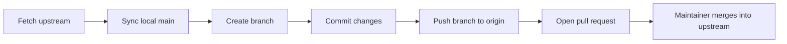

# Lecture 3 — The fork model: contributing without commit access

> **Duration:** ~2 hours. **Outcome:** You can explain why forks exist, fork a repository you don't own, wire up the `upstream` remote, and keep your fork in sync as the original project moves on — the exact loop behind every open-source contribution.

## 1. The problem forks solve

You've found a bug in an open-source project. You know the fix. You clone the repo, make the change, and run `git push`. Git says:

```
remote: Permission to their-org/their-repo.git denied to you.
fatal: unable to access ... The requested URL returned error: 403
```

Of course it did — you don't have write access to a stranger's repository, and you shouldn't. Anyone being able to push to any public repo would be chaos. So how does *anyone* contribute to projects they don't own? Millions of pull requests a year get merged into repos whose authors never met the contributor. The answer is the **fork model**.

> A **fork** is your own server-side copy of someone else's repository, under *your* account, that you *can* push to. You make changes on your fork, then politely ask the original project to pull them in via a **pull request**.

Forking decouples "having a copy you can change" from "having permission to change the original." You get full write access to your copy; the maintainer keeps full control over theirs. Everybody's happy.

## 2. Fork vs. clone vs. branch — three words people mix up

These get confused constantly. Nail the distinction:

| Term | Where it lives | Who owns it | What it's for |
|------|---------------|-------------|---------------|
| **Branch** | Inside one repository | Whoever owns that repo | A parallel line of work *within* a repo |
| **Clone** | On your local disk | You (locally) | A working copy on your machine |
| **Fork** | On the server, under your account | You | A full server-side copy you can push to |

A fork is a *server-side* concept (GitHub creates it for you). A clone is *local*. A branch lives *inside* a repo. A typical contribution uses all three: you **fork** on GitHub, **clone** your fork to your laptop, make a **branch** for your change, push it to your fork, and open a pull request. We'll walk that whole path.

## 3. The two-remote setup: `origin` and `upstream`

Here is the mental model that makes forks click. After you fork and clone, your local repo talks to **two** servers:

```
         (you push here)              (you fetch updates here)
   ┌──────────────────────┐      ┌───────────────────────────┐
   │  origin               │      │  upstream                 │
   │  github.com/YOU/repo  │      │  github.com/THEM/repo     │
   │  = your fork          │      │  = the original project   │
   └──────────┬───────────┘      └─────────────┬─────────────┘
              │  push / pull                    │  fetch only
              └──────────────┬──────────────────┘
                             ▼
                   your local clone (laptop)
```

- **`origin`** = your fork. You have write access. You push your branches here.
- **`upstream`** = the original repo. You have read access only. You *fetch* from it to stay current, but you never push to it.

When you `git clone` your fork, you get `origin` for free (it's the fork you cloned). You add `upstream` yourself:

```bash
git clone https://github.com/YOU/repo.git
cd repo
git remote add upstream https://github.com/THEM/repo.git
git remote -v
# origin    https://github.com/YOU/repo.git   (fetch/push)  <- your fork
# upstream  https://github.com/THEM/repo.git  (fetch/push)  <- the original
```

That's the whole architecture. Everything else is routine Git you already know, pointed at the right remote.

## 4. Forking, step by step

### With the web UI

1. Go to the project's GitHub page.
2. Click **Fork** (top right). GitHub copies the repo into your account: `github.com/YOU/repo`.
3. Clone *your fork* (not the original):
   ```bash
   git clone https://github.com/YOU/repo.git
   cd repo
   ```
4. Add the original as `upstream`:
   ```bash
   git remote add upstream https://github.com/THEM/repo.git
   ```

### With the `gh` CLI (one command does it all)

```bash
gh repo fork THEM/repo --clone
```

That forks the repo to your account, clones your fork locally, *and* automatically adds an `upstream` remote pointing at the original. It's the fastest path and it wires everything correctly. Verify with `git remote -v`.

## 5. Making and offering a change

The contribution loop, start to finish:

```bash
# 1. Always start from a fresh upstream base (details in Section 6)
git fetch upstream
git switch main
git merge upstream/main            # or: git rebase upstream/main

# 2. Branch for your change — never work on main directly
git switch -c fix-typo-in-readme

# 3. Make the change, commit it
# ...edit files...
git commit -am "Fix typo in installation section"

# 4. Push the branch to YOUR fork (origin), setting upstream tracking
git push -u origin fix-typo-in-readme

# 5. Open a pull request against the original project
gh pr create --fill
# (or click the "Compare & pull request" button GitHub shows after a push)
```

Step 5 creates a **pull request**: a formal "please pull my `fix-typo-in-readme` branch into your `main`." The maintainer reviews it, maybe asks for changes, and eventually merges (or declines). Note that you branched *before* changing anything — working on a dedicated branch keeps your `main` clean so it can mirror upstream, which matters enormously for staying in sync.

Why branch instead of committing to `main`? Because your `main` should stay a pristine mirror of `upstream/main`. If you commit your own work onto `main`, syncing with upstream turns into a mess of merges and conflicts. Keep `main` clean; do all work on topic branches. This is the single most common beginner mistake in the fork model.


*The contribution loop: every step routes through either your fork or the original project, never both at once.*

## 6. Keeping your fork in sync

Here's the catch with forks: the moment GitHub creates your fork, it **stops tracking** the original automatically. The original project keeps getting commits; your fork does not. A week later your fork is behind, and a PR built on stale code invites conflicts. So you must periodically pull upstream's new commits into your fork. Two ways.

### The command-line way (what you should understand)

```bash
git fetch upstream                 # download the original's new commits into upstream/*
git switch main                    # be on your local main
git merge upstream/main            # fast-forward main to match the original
git push origin main               # update your fork on GitHub too
```

Read it as a sentence: *fetch the original's changes, move my local `main` up to match, then push so my fork on GitHub matches as well.* Because you kept `main` clean (Section 5), that `merge` is a clean fast-forward — no conflicts, no merge commit. If you instead prefer a linear history:

```bash
git fetch upstream
git switch main
git rebase upstream/main
git push origin main
```

Do this **before starting any new contribution**, so every branch you cut begins from the latest upstream code.

### The shortcut ways

- **GitHub web UI:** on your fork's page, click **Sync fork → Update branch**. Good for a quick catch-up when `main` has no local changes.
- **`gh` CLI:** `gh repo sync YOU/repo` syncs your fork's default branch from upstream in one command.

Use the shortcuts freely, but make sure you can do the four-command version by hand — it's the same mechanism, and it's what you'll need when a shortcut isn't available or when the sync isn't a clean fast-forward.

## 7. The complete picture

Putting Lectures 1–3 together, the full lifecycle of an open-source contribution:

| Step | Command(s) | Remote involved |
|------|-----------|-----------------|
| 1. Fork | `gh repo fork THEM/repo --clone` | Creates `origin` (yours) + `upstream` (theirs) |
| 2. Sync before work | `git fetch upstream && git merge upstream/main` | `upstream` → local |
| 3. Branch | `git switch -c my-fix` | local |
| 4. Commit | `git commit -am "..."` | local |
| 5. Push | `git push -u origin my-fix` | `origin` (your fork) |
| 6. Pull request | `gh pr create --fill` | `origin` → `upstream` |
| 7. Address review | edit, commit, `git push` | `origin` (PR updates automatically) |
| 8. Stay current | `git fetch upstream && git merge upstream/main && git push origin main` | `upstream` → local → `origin` |

Memorize the shape, not the exact flags. `origin` = mine, push here. `upstream` = theirs, fetch here. Branch for every change. Sync before you start.

## 8. Common pitfalls

- **"My PR shows hundreds of unrelated commits."** Your branch was cut from a stale `main`. Sync with upstream, then rebase your branch onto the fresh `upstream/main`.
- **"I committed straight to `main` and now sync fails."** Move those commits to a branch (`git branch my-work`), reset `main` to `upstream/main` (`git reset --hard upstream/main`), and push. Then keep `main` clean.
- **"I pushed to `upstream` by mistake."** You can't — you don't have write access, so Git will reject it. That rejection is the model protecting the original project.
- **"I forked but forgot `upstream`."** Add it any time: `git remote add upstream https://github.com/THEM/repo.git`.

## 9. Check yourself

- In one sentence, what problem does forking solve that cloning does not?
- What do `origin` and `upstream` point at in a fork workflow, and which one can you push to?
- Why should you never commit your own work directly onto your fork's `main`?
- Give the four commands that sync your fork's `main` with the original project.
- What is a pull request, in terms of branches and repos?
- Your PR suddenly shows dozens of commits you didn't write. What went wrong and how do you fix it?

If you can answer all six, you're ready for the exercises — where you'll actually do every step on a real repository.

## Further reading

- **GitHub Docs — "About forks":** <https://docs.github.com/en/pull-requests/collaborating-with-pull-requests/working-with-forks/about-forks>
- **GitHub Docs — "Syncing a fork":** <https://docs.github.com/en/pull-requests/collaborating-with-pull-requests/working-with-forks/syncing-a-fork>
- **GitHub Docs — "Fork a repo":** <https://docs.github.com/en/get-started/quickstart/fork-a-repo>
- **GitHub Docs — "Creating a pull request from a fork":** <https://docs.github.com/en/pull-requests/collaborating-with-pull-requests/proposing-changes-to-your-work-with-pull-requests/creating-a-pull-request-from-a-fork>
