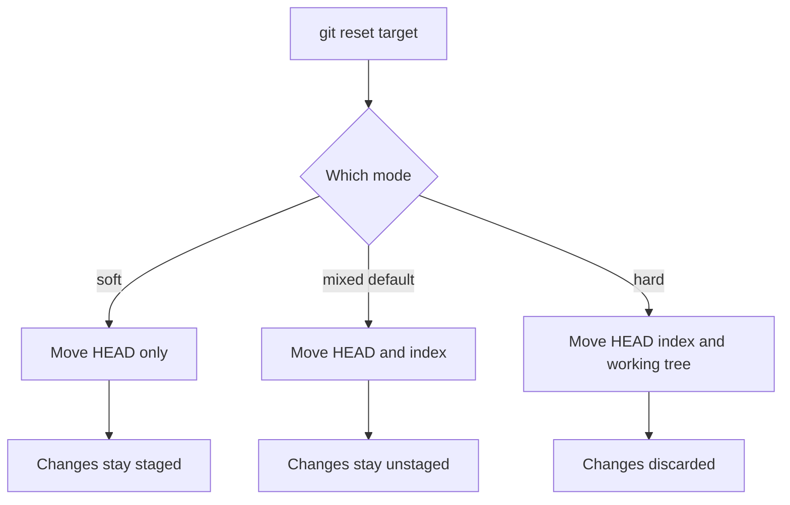
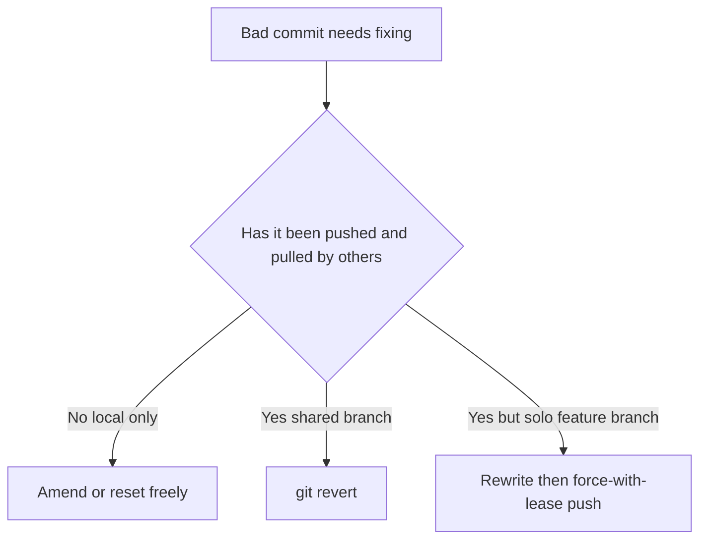

# Lecture 1 — Amend and the Three Resets

> **Duration:** ~2 hours. **Outcome:** You can fix the last commit with `--amend`, move HEAD around with all three resets, and predict exactly what happens to your working tree, index, and history before you press Enter — including when a rewrite is safe and when it is a landmine.

Everyone's first rewrite is the same story: you commit, then immediately notice a typo in the message, or a file you forgot to stage. The beginner reflex is to make a second commit — `"fix typo"`, `"actually add the file"` — and now your history has noise in it forever. This lecture kills that reflex. You will learn to edit the last commit in place, and then the more powerful (and more dangerous) tool underneath it: `reset`, which can rewind history to any point you like.

The whole lecture rests on one model you already met in Week 1: **the three trees.**

## 1. The three trees, one more time

Git is built around three "trees" — three snapshots of your files that live at different stages of the commit pipeline.

| Tree | Also called | What it is | How you see it |
|------|-------------|------------|----------------|
| **HEAD** | the last commit | A pointer to the commit you're currently on | `git log -1`, `git show HEAD` |
| **Index** | the staging area, the cache | What *will* go into your next commit | `git status`, `git diff --staged` |
| **Working tree** | the working directory | The actual files on disk you edit | `ls`, your editor, `git diff` |

The normal flow moves changes left across the trees: you edit the **working tree**, `git add` copies changes into the **index**, and `git commit` writes the index into a new commit that **HEAD** now points at.

```
 working tree  --git add-->  index  --git commit-->  HEAD (new commit)
```

Every command this lecture teaches is really "move one or more of these three trees to a different state." `amend` rewrites HEAD's commit. `reset` moves HEAD, and optionally the index and working tree with it. Hold this picture in your head and nothing below is mysterious.

## 2. `git commit --amend` — the "I forgot something" button

`--amend` replaces the most recent commit with a new one built from whatever is currently staged, plus (by default) a chance to edit the message.

```bash
# Fix just the message of the last commit
git commit --amend -m "feat(auth): add password reset endpoint"

# You forgot a file. Stage it, then fold it into the last commit:
git add forgotten_file.py
git commit --amend --no-edit          # --no-edit keeps the existing message

# Open the editor to rewrite the message interactively
git commit --amend
```

### Amend does not *edit* — it *replaces*

This is the single most important idea in the whole week, so read it twice. A commit is **immutable**: its SHA-1 hash is computed from its contents (tree, parent, author, message). You cannot change a commit. When you "amend," Git builds a *brand-new* commit with a *new SHA* and moves the branch pointer to it. The old commit is now unreferenced — orphaned, but not gone (Lecture 3 shows you it's still in the reflog).

```bash
git log --oneline -1        # note the SHA, e.g. a1b2c3d
git commit --amend --no-edit
git log --oneline -1        # different SHA now, e.g. f9e8d7c — new commit
```

Because the SHA changes, **amending a commit you have already pushed rewrites shared history.** More on that danger in §6.

## 3. `git reset` — moving HEAD (and maybe more)

`git reset` points the current branch at a different commit. Its three modes differ only in *how much they drag along* — do they also update the index and working tree, or just the branch pointer?

```bash
git reset --soft  <commit>    # move HEAD only
git reset --mixed <commit>    # move HEAD + index  (this is the DEFAULT)
git reset --hard  <commit>    # move HEAD + index + working tree
```

Here is the decision table. Memorise it.

| Mode | HEAD moves? | Index reset? | Working tree touched? | Net effect |
|------|:-----------:|:------------:|:---------------------:|------------|
| `--soft` | ✅ | ❌ | ❌ | Undo the commit, keep changes **staged** |
| `--mixed` (default) | ✅ | ✅ | ❌ | Undo the commit, keep changes **unstaged** |
| `--hard` | ✅ | ✅ | ✅ | Undo the commit **and discard the changes** |

The mental model: all three move HEAD. `--soft` stops there. `--mixed` also empties the staging area back to match the new HEAD. `--hard` goes all the way and overwrites your files on disk. `--soft` and `--mixed` never lose work; **`--hard` can**, because it throws away uncommitted changes in the working tree.


*How the three reset modes differ in what they move and what they leave behind.*

### 3a. The classic use: "un-commit but keep my work"

You committed too early. You want the commit undone but every change kept, ready to re-commit differently.

```bash
git reset --soft HEAD~1     # commit gone, all changes still staged
# ...or...
git reset HEAD~1            # same, but changes now unstaged (--mixed is default)
```

`HEAD~1` means "one commit before HEAD." `HEAD~3` means three back. You can also reset to an explicit SHA.

### 3b. Squash-by-reset

`--soft` gives you a poor-man's squash. Reset back over several commits, then commit once:

```bash
git reset --soft HEAD~3     # collapse the last 3 commits' pointer
git commit -m "feat: complete the search feature"   # one clean commit
```

The three commits' *changes* are all still staged (nothing was lost), but now they form a single commit. Lecture 2 does this more surgically with interactive rebase, but the reset trick is worth knowing.

### 3c. `git reset` on a *file* (a different, gentler thing)

`git reset <path>` (with a path, no mode flag) does not move HEAD at all — it just unstages that file. It is the inverse of `git add`.

```bash
git add secret.env          # oops, staged something I shouldn't
git reset secret.env        # unstage it; file on disk is untouched
```

Modern Git gives this its own verb, which is clearer:

```bash
git restore --staged secret.env   # same effect, less ambiguous
```

## 4. `reset` vs `revert` — know the difference

Beginners conflate these constantly. They solve different problems.

| | `git reset` | `git revert` |
|--|-------------|--------------|
| What it does | Moves the branch pointer backward; rewrites history | Adds a **new** commit that undoes an old one |
| History | Rewritten (old commits orphaned) | Preserved (nothing removed) |
| Safe on shared branches? | **No** | **Yes** |
| Use when | The bad commits are local and un-pushed | The bad commit is already public |

If a broken commit is already on `main` that your team pulled, you **revert** it — a forward-moving undo everyone can pull cleanly. You do **not** reset `main` back and force-push; that rewrites history under your teammates' feet (see §6).

```bash
git revert a1b2c3d          # creates "Revert: ..." commit undoing a1b2c3d
```

## 5. A worked walkthrough

Run this in a throwaway repo to feel all three resets. Watch `git status` and `git log --oneline` after each step.

```bash
mkdir /tmp/reset-demo && cd /tmp/reset-demo && git init -q
echo "one"   > file.txt && git add . && git commit -qm "c1: one"
echo "two"  >> file.txt && git add . && git commit -qm "c2: two"
echo "three">> file.txt && git add . && git commit -qm "c3: three"

git log --oneline           # three commits: c3, c2, c1

# SOFT: undo c3, keep its change staged
git reset --soft HEAD~1
git status                  # "Changes to be committed: file.txt"
git log --oneline           # c3 is gone from history

git reset --soft HEAD@{1}   # (reflog) put c3 back — restore the pointer

# MIXED: undo c3, keep its change but unstaged
git reset HEAD~1
git status                  # "Changes not staged for commit: file.txt"

git add . && git commit -qm "c3: three"   # recommit to reset the scene

# HARD: undo c3 AND throw away the change — destructive
git reset --hard HEAD~1
git status                  # clean; "three" line is GONE from file.txt
cat file.txt                # only "one" and "two" remain
```

Notice the recovery step used `HEAD@{1}` — that is a reflog reference, "where HEAD pointed one move ago." Even after the `--hard`, commit c3 is still recoverable via `git reflog`; Lecture 3 makes that a superpower.

## 6. The danger zone: rewriting *shared* history

Everything above is safe as long as the commits you rewrite are **local and un-pushed**. The moment a commit is on a remote branch that someone else has pulled, rewriting it causes real pain.

Why? When you amend or reset a pushed commit and force-push, you replace commits on the remote with *new* commits (new SHAs). Anyone who already had the old commits now has history that diverges from the remote. Their next `git pull` produces a confusing merge or, worse, they re-introduce the commits you were trying to remove.

**The Golden Rule of Rewriting:**

> Never rewrite history that exists outside your own machine. If you didn't `push` it, rewrite freely. If you did push it — and anyone might have pulled it — don't rewrite; add a new commit (`revert`) instead.

The one honest exception is a branch that is *yours alone* — a personal feature branch nobody else builds on. Then a force-push is fine, and you should use the safe variant:

```bash
git push --force-with-lease origin my-feature
```

`--force-with-lease` refuses the push if the remote has commits you haven't seen — it protects you from clobbering a teammate's work that landed while you were rebasing. Prefer it over the blunt `--force` every single time.

| Situation | Safe to rewrite? | Do this |
|-----------|:----------------:|---------|
| Commit is un-pushed, local only | ✅ Yes | `amend` / `reset` / `rebase` freely |
| Commit is on your solo feature branch | ⚠️ With care | Rewrite, then `push --force-with-lease` |
| Commit is on a shared branch others pulled | ❌ No | `git revert` — never force-push |
| Commit is on `main`/`master`/`release` | ❌ Never | `git revert`; treat these as append-only |


*Deciding whether to rewrite history in place or add a revert commit.*

## 7. Check yourself

- Why does `git commit --amend` produce a new SHA instead of editing the old commit?
- After `git reset --soft HEAD~1`, where are the changes from the undone commit — staged, unstaged, or gone?
- Which reset mode can lose uncommitted work, and why?
- What is the difference between `git reset HEAD~1` and `git revert HEAD`?
- Your commit is already pushed and a teammate pulled it. It's wrong. Reset or revert?
- Why is `--force-with-lease` safer than `--force`?

When all six are automatic, the [exercises](../exercises/exercise-01-amend-and-reset.md) drill them into your fingers.

## Further reading

- **Pro Git — "Undoing Things":** <https://git-scm.com/book/en/v2/Git-Basics-Undoing-Things>
- **Pro Git — "Reset Demystified"** (the definitive three-trees explainer): <https://git-scm.com/book/en/v2/Git-Tools-Reset-Demystified>
- **`git reset` reference:** <https://git-scm.com/docs/git-reset>
- **`git commit --amend` reference:** <https://git-scm.com/docs/git-commit#Documentation/git-commit.txt---amend>
