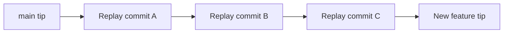

# Lecture 2 — Interactive Rebase

> **Duration:** ~2 hours. **Outcome:** You can open an interactive rebase, and confidently squash, reword, reorder, edit, drop, and `fixup` commits — then automate the whole cleanup with `--autosquash` so a branch of ten messy commits becomes three logical ones a reviewer will thank you for.

Interactive rebase (`git rebase -i`) is the power tool of history editing. Where `amend` fixes the *last* commit and `reset` bluntly rewinds, interactive rebase lets you open up a *range* of commits and rewrite each one — change order, combine several into one, split one into several, edit a message, or delete a commit entirely. It is how professionals turn a working-but-ugly branch into a clean, reviewable story before opening a pull request.

## 1. What rebase actually does

"Rebase" means: take a series of commits and **replay them, one at a time, on top of a new base.** Git records the *diff* each commit introduced, then re-applies those diffs in order onto the target, creating brand-new commits (new SHAs) as it goes.

A plain rebase moves a branch onto a new starting point:

```bash
git switch feature
git rebase main        # replay feature's commits on top of the latest main
```

The **interactive** flavour (`-i`) adds a step: before replaying, Git opens an editor with a to-do list of the commits, and *you* decide what happens to each one.

```bash
git rebase -i HEAD~5   # edit the last 5 commits
git rebase -i main     # edit every commit on this branch since it left main
```

Because rebase creates new commits, the same Golden Rule from Lecture 1 applies: **only rebase commits you haven't shared.** Rebasing published commits and force-pushing breaks anyone who pulled them.


*Rebase replays each commit's diff, one at a time, onto the new base.*

## 2. The to-do list and its verbs

When you run `git rebase -i HEAD~4`, Git opens something like this (oldest commit at the **top**):

```
pick a1b2c3d feat: add search box
pick b2c3d4e wip
pick c3d4e5f fix typo
pick d4e5f6a more search stuff

# Rebase 9f8e7d6..d4e5f6a onto 9f8e7d6
# Commands:
# p, pick   = use commit
# r, reword = use commit, but edit the commit message
# e, edit   = use commit, but stop for amending
# s, squash = use commit, but meld into previous commit
# f, fixup  = like squash, but discard this commit's log message
# d, drop   = remove commit
```

You edit this list, save, and close. Git executes it top to bottom. The verbs you'll use constantly:

| Verb | Short | What it does |
|------|:-----:|--------------|
| `pick` | `p` | Keep the commit as-is |
| `reword` | `r` | Keep the commit's changes, but edit its message |
| `edit` | `e` | Pause at this commit so you can amend its content or split it |
| `squash` | `s` | Merge this commit into the one **above** it; combine both messages |
| `fixup` | `f` | Like squash, but **throw away** this commit's message |
| `drop` | `d` | Delete the commit (and its changes) entirely |
| `reorder` | — | Just move the lines up or down to change commit order |

Two things trip people up:

1. **Order is oldest-first** — top of the list is the earliest commit. This is the reverse of `git log`, which shows newest first.
2. **`squash`/`fixup` merge *upward*** — into the line above. So the commit you're keeping goes first, and the ones absorbing into it go below.

## 3. Squashing — the most common cleanup

You built a feature across four commits: one real commit and three "wip / fix / typo" follow-ups. You want reviewers to see one clean commit.

Start the rebase:

```bash
git rebase -i HEAD~4
```

Change the to-do list so the follow-ups `fixup` into the first:

```
pick   a1b2c3d feat: add search box
fixup  b2c3d4e wip
fixup  c3d4e5f fix typo
fixup  d4e5f6a more search stuff
```

Save and close. The four commits collapse into a single `feat: add search box` commit with all four sets of changes. Use `fixup` (not `squash`) when the follow-up messages are junk you don't want to keep. Use `squash` when each message has something worth folding into the final message — Git will open an editor letting you combine them.

## 4. Rewording, reordering, dropping

All three are just edits to the to-do list.

**Reword** — fix a bad message without touching code:

```
reword a1b2c3d feat: add serch box     # will open an editor to fix "serch"
pick   b2c3d4e docs: update README
```

**Reorder** — move the lines. Git replays in the new order. (Beware: reordering commits that touch the same lines can cause conflicts — resolve them as they come.)

```
pick   b2c3d4e docs: update README     # was second, now first
pick   a1b2c3d feat: add search box
```

**Drop** — delete a commit you never wanted (a debug print, a committed secret, an experiment):

```
pick   a1b2c3d feat: add search box
drop   b2c3d4e temp: add debug logging   # gone, along with its changes
```

Deleting the line entirely does the same thing as `drop` — Git treats any commit missing from the list as dropped. `drop` is just more explicit and safer (you won't lose a commit by accidentally deleting a line).

## 5. `edit` — stopping to change a commit's contents

`edit` (`e`) pauses the rebase *at* that commit, with the commit's changes applied and HEAD sitting on it, so you can modify it — amend its content, or even split it into two.

```
edit a1b2c3d feat: add search box
pick b2c3d4e docs: update README
```

When the rebase stops, you're on the commit. Now:

```bash
# --- to amend this commit's content ---
# edit files, then:
git add .
git commit --amend
git rebase --continue

# --- to SPLIT this commit into two ---
git reset HEAD~1              # undo the commit, keep changes unstaged (Lecture 1!)
git add search_ui.py
git commit -m "feat: add search UI"
git add search_backend.py
git commit -m "feat: add search backend"
git rebase --continue
```

The split trick reuses `reset --mixed` from Lecture 1 — this is why that lecture came first. `git rebase --continue` resumes the to-do list once you're done at each `edit` stop.

## 6. When a rebase hits a conflict

Because rebase replays diffs, a replayed commit can conflict with the new base. Git stops and tells you. You have three options at every stop:

```bash
# 1) Resolve, then continue
#    edit the conflicted files, then:
git add <resolved-files>
git rebase --continue

# 2) Skip this commit (rarely what you want)
git rebase --skip

# 3) Bail out entirely — undo the whole rebase, back to where you started
git rebase --abort
```

`git rebase --abort` is your safety net: it returns the branch to its exact pre-rebase state, no harm done. If a rebase ever feels out of control, abort, breathe, and try again with a smaller range.

## 7. The professional flow: `--fixup` + `--autosquash`

Squashing by hand-editing the to-do list works, but there's a slicker, industry-standard workflow that marks commits *as you make them* and then lets Git assemble the to-do list automatically.

While working, when you make a change that belongs in an earlier commit, commit it as a **fixup** targeting that commit's SHA:

```bash
git log --oneline
# a1b2c3d feat: add search box   <-- I want this fix to fold into here

# make the fix, then:
git add search.py
git commit --fixup a1b2c3d       # message becomes "fixup! feat: add search box"
```

You can keep working and stack several `--fixup!` (and `--squash!`) commits. When you're ready to clean up, run:

```bash
git rebase -i --autosquash main
```

`--autosquash` reads the `fixup!`/`squash!` prefixes and **pre-arranges the to-do list for you** — each fixup is moved directly below its target and set to `fixup`. You just review and save. Modern Git can even default this on:

```bash
git config --global rebase.autosquash true    # --autosquash on every rebase -i
```


*The fixup plus autosquash workflow: mark fixups as you go, then let Git assemble the cleanup.*

A related time-saver: `git commit --amend` targets only the *last* commit, but `--fixup` targets *any* commit — making it the tool of choice when the thing you need to fix is buried three commits back.

| Tool | Fixes which commit? | When to reach for it |
|------|---------------------|----------------------|
| `git commit --amend` | Only the most recent | Quick fix to the last commit |
| `git commit --fixup <sha>` | Any commit in the branch | Fix belongs in an older commit; squash later |
| `git rebase -i` | Any range, any operation | Reorder/squash/reword/drop several at once |

## 8. A full worked example

```bash
mkdir /tmp/rebase-demo && cd /tmp/rebase-demo && git init -q
echo base > app.py && git add . && git commit -qm "chore: init"

echo "def search(): pass" >> app.py && git add . && git commit -qm "feat: add search"
echo "# oops"             >> app.py && git add . && git commit -qm "wip"
echo "def sort(): pass"   >> app.py && git add . && git commit -qm "feat: add sort"
echo "# typo fix"         >> app.py && git add . && git commit -qm "fix typo"

git log --oneline         # 5 commits, two of them junk

# Clean it up: fold "wip" into "feat: add search",
# fold "fix typo" into "feat: add sort", and reorder so features are together.
git rebase -i HEAD~4
# In the editor, arrange to:
#   pick  feat: add search
#   fixup wip
#   pick  feat: add sort
#   fixup fix typo

git log --oneline         # now just: chore: init, feat: add search, feat: add sort
```

Three clean commits from five messy ones — and every change is preserved, just reorganised.

## 9. Check yourself

- In the rebase to-do list, is the oldest commit at the top or the bottom?
- What is the difference between `squash` and `fixup`?
- Which verb do you use to *split* one commit into two, and what Lecture-1 command does the split rely on?
- You're mid-rebase and a conflict looks hopeless. What command returns you safely to the start?
- What does `git commit --fixup <sha>` do that `git commit --amend` cannot?
- What does `--autosquash` automate?

When these are second nature, [exercise 2](../exercises/exercise-02-clean-up-with-interactive-rebase.md) has you turn six sloppy commits into three.

## Further reading

- **Pro Git — "Rewriting History":** <https://git-scm.com/book/en/v2/Git-Tools-Rewriting-History>
- **`git rebase` reference (see the "interactive mode" section):** <https://git-scm.com/docs/git-rebase>
- **Atlassian — "Rewriting history" tutorial:** <https://www.atlassian.com/git/tutorials/rewriting-history>
- **`--autosquash` explained:** <https://git-scm.com/docs/git-rebase#Documentation/git-rebase.txt---autosquash>
