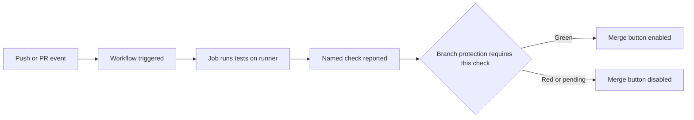

# Lecture 3 — Required Status Checks and Branch Protection

> **Duration:** ~1.5 hours. **Outcome:** You can turn a passing workflow into an enforced gate — configuring branch protection and required status checks so a failing check blocks the merge button, and understanding exactly what each protection setting does and how it can be bypassed.

You now have a workflow that reports a green ✓ or red ✗ on every pull request. But a red check, by itself, is only *advice*. Anyone with write access can still click "Merge" straight through it. This lecture closes that gap. We make the check a **rule**: the merge button goes grey and stays grey until the check is green. This is the payoff of the whole week — the mechanism by which broken code becomes *unable* to reach `main`.

## 1. The difference between a check and a gate

A **status check** is the result of a workflow run, attached to a commit: passed, failed, or pending. It is *informational*. GitHub shows it, but does not, on its own, prevent anything.

A **required status check** is that same check, promoted to a **merge requirement** by a branch protection rule. Now GitHub refuses to merge a pull request into the protected branch until the named check reports success.

| | Status check | Required status check |
|-|--------------|-----------------------|
| Shows on the PR | Yes | Yes |
| Blocks merge if red | **No** | **Yes** |
| Blocks merge if pending | No | **Yes** |
| Configured where | Automatically, by running a workflow | Branch protection rule / ruleset |

The promotion from the left column to the right is the entire job of this lecture. Nothing about your *workflow* changes — you configure a rule *on the branch* that points at a check *by name*.

## 2. What branch protection is

**Branch protection** is a set of rules attached to a branch (or a name pattern like `release/*`) that constrain how commits get onto it. GitHub offers protection through two overlapping systems:

- **Branch protection rules** — the original, per-branch UI under Settings → Branches.
- **Rulesets** — a newer, more flexible system (Settings → Rules → Rulesets) that can target multiple branches with layered rules and clearer bypass control.

Both can enforce required status checks; rulesets are the direction GitHub is heading and are what we recommend for new repos. The concepts below apply to either.

The protections you can turn on include:

| Protection | Effect |
|------------|--------|
| **Require status checks to pass** | Named checks must be green before merge — *the one this week is about* |
| **Require branches to be up to date** | The PR must include the latest `main` before its checks count |
| **Require a pull request before merging** | No direct pushes to the branch; everything goes through a PR |
| **Require approvals** | N reviewer approvals before merge (Week 5 territory) |
| **Require conversation resolution** | All PR comments resolved before merge |
| **Require linear history** | No merge commits — squash or rebase only |
| **Do not allow bypassing** | Even admins are subject to the rules |
| **Restrict who can push** | Only named people/teams can push to the branch |

This week, the load-bearing one is the first: **require status checks to pass.** The rest are complements you'll layer in during the mini-project and Week 8.

## 3. Wiring it up (UI)

The click-path, once your workflow has run at least once (it must have run so GitHub knows the check's name):

1. Repo → **Settings** → **Branches** (or **Rules → Rulesets → New ruleset**).
2. Add a rule targeting **`main`**.
3. Enable **Require a pull request before merging** — this stops direct pushes, forcing everything through a reviewable, checkable PR.
4. Enable **Require status checks to pass before merging.**
5. In the search box that appears, **type the check's name** (e.g. `test`, or a matrix leaf like `test (ubuntu-latest, 20)`) and select it. This is why the workflow must have run once — GitHub populates the list from checks it has actually seen.
6. Recommended: enable **Require branches to be up to date before merging** so a PR can't pass against a stale base (more on this trap in §5).
7. Save.

From now on, a PR into `main` shows the merge button **disabled** with "Required statuses must pass" until the named check goes green.

## 4. Wiring it up (CLI / API)

You can script protection with the GitHub CLI, which matters when you manage many repos or want your protection itself under version control. The classic branch-protection endpoint:

```bash
gh api -X PUT repos/:owner/:repo/branches/main/protection \
  -H "Accept: application/vnd.github+json" \
  -f "required_status_checks[strict]=true" \
  -f "required_status_checks[contexts][]=test" \
  -f "enforce_admins=true" \
  -f "required_pull_request_reviews[required_approving_review_count]=1" \
  -f "restrictions=null"
```

Reading it: require the `test` status check (`contexts[]`), require branches be up to date (`strict=true`), apply the rules to admins too (`enforce_admins=true`), and require one approval. `restrictions=null` means "don't restrict who can push" (beyond the PR requirement).

To inspect what's currently enforced:

```bash
gh api repos/:owner/:repo/branches/main/protection | jq '.required_status_checks'
```

Rulesets have their own endpoint (`repos/:owner/:repo/rulesets`) and can be exported/imported as JSON — handy for applying identical protection across an org.

## 5. The traps (read this twice)

Required checks have three classic failure modes. Knowing them separates people who *configured* CI from people who *rely* on it.

### 5.1 The "check never ran" deadlock

If you require a check named `test`, but a particular PR's workflow **never runs** — because a `paths` filter excluded it, or the workflow file has a syntax error, or the trigger doesn't match — then the required check is **stuck pending forever**, and the PR can never merge. The gate is doing its literal job: it will not pass a check it never saw succeed.

Avoid it: keep the workflow that produces your *required* check **unfiltered** (no `paths` filter), or provide a tiny fallback job that always runs and reports the same check name. Never make a heavily-filtered workflow the source of a required check.

### 5.2 The stale-base merge (why "up to date" matters)

Suppose `main` has tests A and B. Your PR passes both. Meanwhile, someone merges a change to `main` that your PR was written against an *older* version of. Your PR's checks passed — but against a stale base. When merged, the combination could break, even though every individual check was green. This is a *semantic* conflict that Git's textual merge won't catch.

**Require branches to be up to date before merging** closes this: the PR must be rebased/merged onto the current `main`, re-running checks against the real merge result, before it can land. The cost is more re-runs on busy repos; the benefit is that a green check means green *against what will actually be `main`.* (GitHub's **merge queue** automates this for high-traffic repos — out of scope this week, noted in `resources.md`.)

### 5.3 The admin bypass

By default, repository admins can *override* a failing required check and merge anyway ("Merge without waiting for requirements"). Sometimes that's a needed escape hatch; often it quietly defeats the whole system. If you truly want *broken code cannot merge, full stop*, you must enable **Do not allow bypassing the above settings** (rulesets) or **Include administrators** (classic protection). Decide deliberately — an un-bypassable rule can also lock you out of an emergency fix.

## 6. Proving the gate works

Never trust a gate you haven't tried to break. The verification ritual:

1. Create a branch. **Deliberately break a test** (change an assertion so it fails).
2. Push, open a PR into `main`.
3. Watch the required check go **red**. Confirm the merge button is **disabled** — GitHub says the required check must pass.
4. Try to merge anyway. As a non-admin, you can't. (As an admin, confirm the "bypass" affordance is gone if you enabled §5.3.)
5. Push a fix that makes the test pass. Watch the check go **green** and the merge button **enable**.
6. Merge.

If step 3 didn't disable the button, your check isn't actually *required* — recheck that the name you required matches the name the workflow reports (matrix leaf names are a common mismatch). You'll do exactly this ritual in Exercise 3 and, at scale, in the mini-project.

## 7. A note on the whole chain

Step back and see the full mechanism you've now built across three lectures:

> A **push** or **PR** (event) triggers a **workflow**, whose **job** runs your tests on a clean **runner** and reports a named **check**. A **branch protection rule** marks that check **required**. GitHub disables the merge button until the check is green. Therefore: *code that fails the tests cannot be merged.*


*The full chain from a push event to a blocked or enabled merge button.*

That sentence is the deliverable of Week 6. Everything else — matrices, caching, lint and coverage gates — makes the check *better*. This lecture makes it *binding*.

## 8. Check yourself

- What is the precise difference between a status check and a *required* status check?
- Why must a workflow have run at least once before you can mark its check required?
- Describe the "check never ran" deadlock and one way to avoid it.
- What problem does "require branches to be up to date before merging" solve that a passing check alone does not?
- By default, can an admin merge past a failing required check? How do you stop that?
- You required `test`, but PRs still merge while red. Give two plausible causes.
- Recite the full event-to-blocked-merge chain in one sentence.

When these are solid, do [Exercise 3](../exercises/exercise-03-required-status-check.md) and then assemble everything in the [mini-project](../mini-project/README.md).

## Further reading

- **About protected branches:** <https://docs.github.com/en/repositories/configuring-branches-and-merges-in-your-repository/managing-protected-branches/about-protected-branches>
- **About rulesets:** <https://docs.github.com/en/repositories/configuring-branches-and-merges-in-your-repository/managing-rulesets/about-rulesets>
- **Managing a branch protection rule:** <https://docs.github.com/en/repositories/configuring-branches-and-merges-in-your-repository/managing-protected-branches/managing-a-branch-protection-rule>
- **Managing a merge queue:** <https://docs.github.com/en/repositories/configuring-branches-and-merges-in-your-repository/configuring-pull-request-merges/managing-a-merge-queue>
