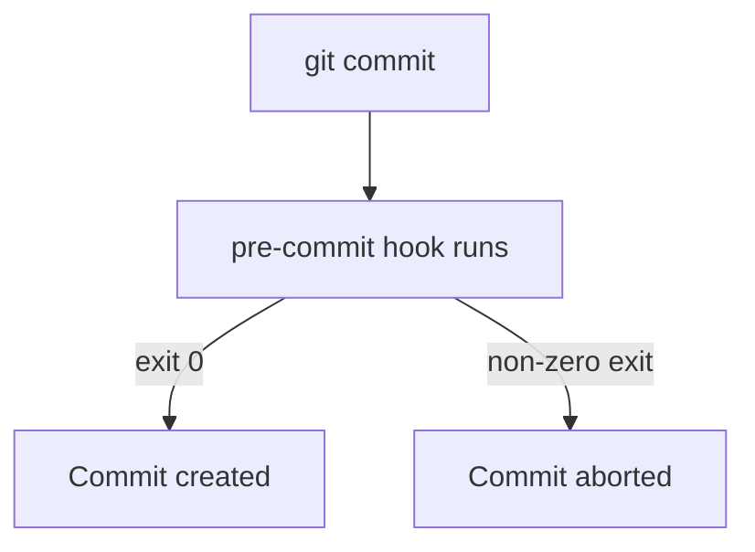
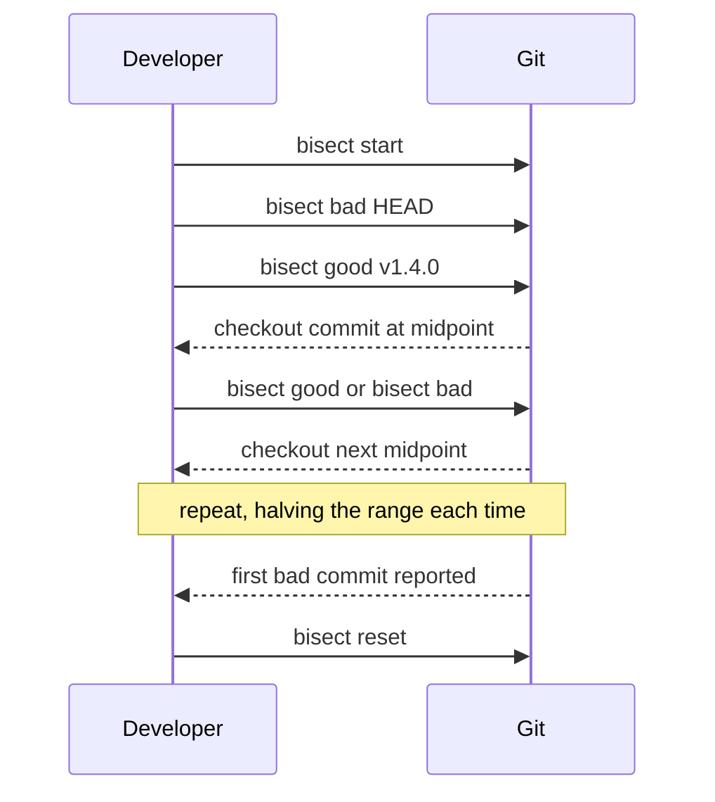

# Lecture 1 — Hooks and `git bisect`

> **Duration:** ~2 hours. **Outcome:** You can write a working client-side hook (and understand the server-side ones), and you can find the exact commit that introduced a bug with `git bisect` — by hand and, when a test exists, automatically with `git bisect run`.

The last six weeks taught you the *core* of Git: the object model, branching, remotes, rewriting history, pull requests, and CI. This week is about the **power tools** — the commands you don't reach for daily, but that turn a bad afternoon into a five-minute fix when the moment comes. We start with the two most immediately useful: **hooks**, which run your own code at key points in Git's lifecycle, and **`bisect`**, which finds a regression with a binary search you'd never do by hand.

Learn the *why* first. Hooks exist because "please remember to run the linter" is a losing strategy — automation beats discipline. Bisect exists because "which of these 400 commits broke it?" is a question your memory cannot answer, but math can.

## 1. What a hook actually is

A **Git hook** is just an executable script that Git runs automatically at a specific moment — before a commit, after a merge, before a push, when the server receives objects. Nothing magic: they live in `.git/hooks/`, they're ordinary programs (shell, Python, Node, anything with a shebang), and Git invokes them by name at the right time.

```bash
ls .git/hooks/
```

Every fresh repo ships a set of `*.sample` files there. Git ignores anything ending in `.sample`; rename one to drop the suffix and make it executable, and it goes live:

```bash
cd .git/hooks
cp pre-commit.sample pre-commit
chmod +x pre-commit
```

That's the whole mechanism. The subtlety is *which* hook fires *when*, and whether it can **block** the operation.

## 2. The hooks worth knowing

Hooks split into **client-side** (run on your machine) and **server-side** (run on the remote when it receives a push). Here are the ones you will actually use:

| Hook | Side | When it runs | Can it block? | Typical use |
|------|------|--------------|:-------------:|-------------|
| `pre-commit` | client | before the commit is created | Yes (non-zero exit aborts) | lint, format, run fast tests, block secrets |
| `prepare-commit-msg` | client | before the editor opens | No | pre-fill the commit message template |
| `commit-msg` | client | after you write the message | Yes | enforce message format (e.g. Conventional Commits) |
| `post-commit` | client | after the commit lands | No | notifications, local bookkeeping |
| `pre-push` | client | before objects are sent to a remote | Yes | run the full test suite before it leaves your machine |
| `pre-receive` | server | remote, before any ref updates | Yes | reject pushes that violate policy, for the whole push |
| `update` | server | remote, once per ref being updated | Yes | per-branch rules (e.g. protect `main`) |
| `post-receive` | server | remote, after all refs update | No | deploy, CI trigger, chat notification |

The **block or not** column is the important one. A hook that can block is a *gate*; a hook that can't is a *reaction*. Exit code is the contract: **exit 0 = allow, any non-zero = abort** (for the hooks that can block).


*Exit code is the whole contract for a blocking hook: zero allows, non-zero aborts.*

## 3. A real `pre-commit` hook

Let's write one that does three genuinely useful things: reject commits that leave `TODO` markers you flagged as blocking, block accidental large files, and run a formatter check. Put this in `.git/hooks/pre-commit`:

```bash
#!/usr/bin/env bash
# .git/hooks/pre-commit — runs before a commit is created.
set -euo pipefail

# Only look at what is actually staged, and only added/changed files.
staged=$(git diff --cached --name-only --diff-filter=ACM)

# 1. Block accidental big files (> 1 MB).
for f in $staged; do
  [ -f "$f" ] || continue
  size=$(wc -c < "$f")
  if [ "$size" -gt 1048576 ]; then
    echo "BLOCKED: $f is $((size/1024)) KB (> 1 MB). Use Git LFS or don't commit it." >&2
    exit 1
  fi
done

# 2. Block a debugging marker you never want to ship.
if git diff --cached -G'DO NOT COMMIT' --name-only | grep -q .; then
  echo "BLOCKED: a staged change contains 'DO NOT COMMIT'." >&2
  exit 1
fi

# 3. If a formatter is available, verify staged files are formatted.
if command -v prettier >/dev/null 2>&1; then
  echo "$staged" | grep -E '\.(js|ts|json|css|md)$' | while read -r f; do
    prettier --check "$f" || {
      echo "BLOCKED: $f is not formatted. Run: prettier --write $f" >&2
      exit 1
    }
  done
fi

echo "pre-commit checks passed."
exit 0
```

Test it:

```bash
echo "x = 1  # DO NOT COMMIT" > scratch.py
git add scratch.py
git commit -m "test"      # aborts — the hook exits non-zero
```

A few things to internalize:

- The hook sees your **staged** state via `git diff --cached`. Check what's *being committed*, not what's merely in your working tree.
- Write to **stderr** (`>&2`) for messages so they don't pollute anything parsing stdout.
- Keep it **fast**. A `pre-commit` hook that takes ten seconds trains people to use `--no-verify`. Slow, thorough checks belong in `pre-push` or CI.

### The escape hatch

`git commit --no-verify` (short: `-n`) skips client-side `pre-commit` and `commit-msg` hooks. This is deliberate — client hooks are conveniences, not security. If a rule *must* hold, enforce it **server-side** or in **CI** (Week 6), where the developer can't bypass it.

## 4. The catch: hooks aren't cloned

`.git/hooks/` lives inside `.git/`, which is **not** part of the tree Git tracks. So hooks do **not** travel with `git clone`. A hook you write only protects *your* machine.

Three standard ways to share hooks with a team:

| Approach | How | Trade-off |
|----------|-----|-----------|
| `core.hooksPath` | commit a `hooks/` dir, run `git config core.hooksPath hooks` | simple, but every dev must run the config once |
| A manager (e.g. **pre-commit**, **husky**, **lefthook**) | commit a config file; the tool installs hooks | one-time `install`, but adds a dependency |
| CI mirror | run the same checks as a required GitHub Actions job | can't be bypassed, but feedback is slower |

The pragmatic answer for most teams: use a hook manager for fast local feedback **and** mirror the exact same checks in required CI. Local hooks make the common case fast; CI makes the rule unskippable.

## 5. `git bisect` — the why

Now the second power tool. You ship on Friday. Monday, someone reports the export button produces a corrupt file. It worked "sometime last week." Between then and now: 300 commits. Which one broke it?

Reading 300 diffs is hopeless. But you don't have to. If you can *answer one question* — "is the bug present at this commit, yes or no?" — then **binary search** finds the culprit in `log2(300) ≈ 9` steps. That's what `git bisect` automates.

The only requirement: the property is **monotonic** — there's a point in history before which it's "good" and after which it's "bad," and it never flips back. Regressions usually are.

## 6. `git bisect` — by hand

You need two known points: a **good** commit (bug absent) and a **bad** commit (bug present, usually `HEAD`).

```bash
git bisect start
git bisect bad                 # HEAD is broken
git bisect good v1.4.0         # this tag/commit was fine
```

Git now checks out a commit **halfway between** them and tells you how many steps remain:

```
Bisecting: 149 revisions left to test after this (roughly 7 steps)
[a1b2c3d...] Refactor the export pipeline
```

You test whatever "the bug" means here — run the app, run one test, click the button — and report the verdict:

```bash
git bisect good     # bug NOT present at this commit
# ...or...
git bisect bad      # bug IS present at this commit
```

Each verdict halves the remaining range. Repeat until Git announces the first bad commit:

```
b4d0000c1t is the first bad commit
commit b4d0000c1t
Author: ...
    Refactor the export pipeline
```

When you're done — always — clean up:

```bash
git bisect reset    # returns you to the branch/commit you started from
```

`git bisect reset` is not optional. Until you run it, you're in a detached `HEAD` mid-search.


*Each verdict halves the remaining range until Git names the first bad commit.*

### Two escape valves

- **Can't test this commit** (it won't build, unrelated breakage)? Use `git bisect skip`. Git picks a nearby commit instead.
- **Lost track?** `git bisect log` prints every verdict so far; `git bisect replay <file>` re-runs a saved log.

## 7. `git bisect run` — automate the verdict

Testing by hand is fine for a nine-step search. But if you can express "is the bug present?" as a **script that exits 0 for good and non-zero for bad**, Git will drive the *entire* search itself.

The contract for the script:

| Exit code | Meaning |
|----------:|---------|
| `0` | this commit is **good** |
| `1`–`124`, `126`, `127` | this commit is **bad** |
| `125` | **skip** — can't test this commit |
| `128`+ | abort the bisect |

So any test command that returns 0 on pass works directly:

```bash
git bisect start
git bisect bad HEAD
git bisect good v1.4.0
git bisect run npm test -- export.test.js
```

Git checks out the midpoint, runs `npm test`, reads the exit code, and moves on — automatically, all the way to the first bad commit. You watch it work.

For a bug with no existing test, write a tiny throwaway one:

```bash
cat > /tmp/check.sh <<'EOF'
#!/usr/bin/env bash
# exit 0 if good, 1 if bad
make build >/dev/null 2>&1 || exit 125   # can't build → skip
./export sample.csv > /tmp/out.bin
# The bug: output is corrupt (wrong magic bytes). Good output starts with "PK".
head -c 2 /tmp/out.bin | grep -q '^PK' && exit 0 || exit 1
EOF
chmod +x /tmp/check.sh
git bisect run /tmp/check.sh
```

Note the `exit 125` for the un-buildable case — that tells bisect to *skip*, not to call it bad. Getting this right is the difference between finding the real culprit and blaming an innocent commit.

### Keep the check script out of the tree

Put the check script somewhere **outside** the repo (like `/tmp`) or it will vanish and reappear as bisect checks out different commits. A script committed only in recent commits won't exist at the old "good" commit.

## 8. When bisect lies to you

Bisect is only as honest as your test. Two traps:

- **Flaky tests.** If the test sometimes fails for reasons unrelated to the bug, bisect will follow the noise to a wrong answer. Make the check deterministic first.
- **Non-monotonic bugs.** If the bug was introduced, accidentally fixed, then reintroduced, "first bad commit" is ambiguous. Bisect assumes one transition. Narrow your `good`/`bad` endpoints to a range where that holds.

## 9. Check yourself

- Where do hooks live, and why don't they survive a `git clone`?
- What exit code does a blocking hook use to *abort* the operation?
- Name one client-side hook that can block and one server-side hook that can block.
- Why should a `must-hold` rule live in CI or a server hook, not just `pre-commit`?
- Bisect needs two starting points. What are they, and which is usually `HEAD`?
- In `git bisect run`, what does exit code `125` mean, and why does it matter?
- What single command do you run to leave a bisect and return to where you were?

When those are automatic, the [exercises](../exercises/README.md) put a hook and a real bisect under your fingers.

## Further reading

- **Git hooks — official docs:** <https://git-scm.com/docs/githooks>
- **Pro Git — "Git Hooks":** <https://git-scm.com/book/en/v2/Customizing-Git-Git-Hooks>
- **`git bisect` — official docs:** <https://git-scm.com/docs/git-bisect>
- **The `pre-commit` framework:** <https://pre-commit.com/>
