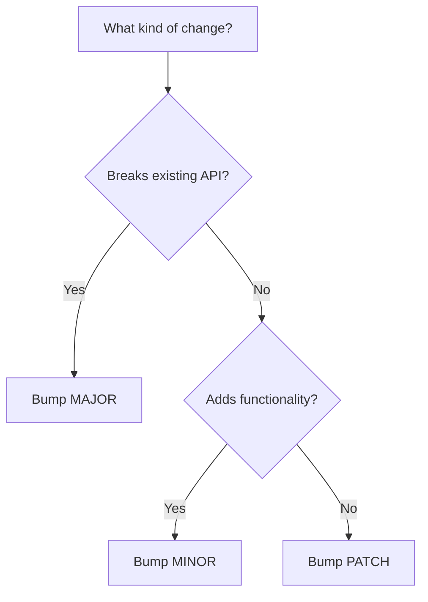
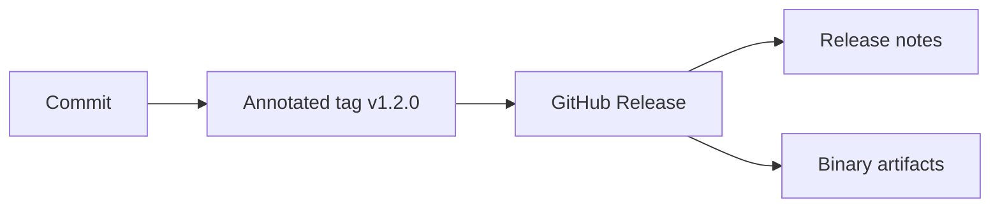

# Lecture 3 — Tags and Releases

> **Duration:** ~2 hours. **Outcome:** You can version software with semantic versioning, create and push annotated tags, and cut a real GitHub Release from the command line with `gh release` — attaching notes and build artifacts.

Hooks automate checks; worktrees let you work in parallel; bisect finds regressions. This lecture is about the *other* end of the lifecycle: **naming a specific point in history as a version and shipping it.** A commit SHA like `b4d0000` is precise but meaningless to humans. A **tag** like `v2.1.0` is a stable, human-readable name for exactly that commit — and a **release** wraps that tag in notes and downloadable artifacts so other people can actually *use* your version.

Get this right and "what version is in production?" and "what changed since 2.0?" become one-command questions instead of archaeology.

## 1. Tags — a name that never moves

A **tag** is a ref that points at a specific commit and, by convention, **never moves**. That's the whole difference from a branch: a branch pointer advances every time you commit on it; a tag is nailed to one commit forever. That permanence is exactly what a version needs.

Git has **two kinds** of tag, and the difference matters:

| | Lightweight tag | Annotated tag |
|---|-----------------|---------------|
| What it is | a name pointing at a commit | a full Git **object**: tagger, date, message, optional GPG signature |
| Created with | `git tag v1.0` | `git tag -a v1.0 -m "…"` |
| Stores metadata? | No | Yes (who, when, why) |
| Can be signed? | No | Yes (`-s`) |
| Use for | temporary/local bookmarks | **every release** |

**Rule: releases always use annotated tags.** They record who cut the release and when, they can be cryptographically signed, and tools like `git describe` treat them as first-class. Lightweight tags are fine as a private "remember this spot" bookmark and nothing more.

## 2. Semantic versioning — the why

Before you name a version, decide *how* you name versions. The near-universal convention is **Semantic Versioning (SemVer)**: `MAJOR.MINOR.PATCH`, e.g. `2.4.1`.

| Part | Bump it when… | Example |
|------|---------------|---------|
| **MAJOR** | you make an **incompatible** API change (existing users' code breaks) | `1.9.0 → 2.0.0` |
| **MINOR** | you add functionality in a **backwards-compatible** way | `2.4.1 → 2.5.0` |
| **PATCH** | you make a **backwards-compatible bug fix** | `2.4.1 → 2.4.2` |


*Deciding which part of MAJOR.MINOR.PATCH to bump is a small decision tree.*

The contract SemVer gives your users: reading the version *tells them the risk of upgrading*. A PATCH bump is safe; a MINOR adds things but won't break them; a MAJOR means "read the migration notes." That predictability is the entire value.

Two more pieces of the spec worth knowing:

- **Pre-release** versions append a hyphen: `2.0.0-rc.1`, `2.0.0-beta.2`. They sort *before* the final `2.0.0`.
- **Build metadata** appends a plus: `2.0.0+build.5`. It's ignored for precedence.
- Start new projects at `0.1.0`. The `0.x` range means "anything may change" — SemVer's stability promises kick in at `1.0.0`.

Tag names conventionally carry a `v` prefix: `v2.4.1`. It's just a convention, but a strong one — `gh`, GitHub Releases, and most tooling expect it.

## 3. Creating and pushing annotated tags

```bash
# Tag the current commit as a release:
git tag -a v1.0.0 -m "First stable release"

# Tag an OLD commit (say you forgot to tag it at the time):
git tag -a v0.9.0 9fceb02 -m "Beta release"

# Inspect a tag — for annotated tags this shows the tagger, date, and message:
git show v1.0.0

# List tags (optionally filtered):
git tag                 # all
git tag -l "v1.*"       # only 1.x
```

The gotcha every beginner hits: **`git push` does not push tags.** Tags are refs outside `refs/heads/`, and a normal push ignores them. You must push them explicitly:

```bash
git push origin v1.0.0        # push one specific tag (preferred)
git push origin --tags        # push ALL local tags (use with care)
git push --follow-tags        # push commits + annotated tags reachable from them
```

Prefer pushing tags **one at a time** or with `--follow-tags`. A blanket `--tags` can shove local experimental tags onto the remote that you never meant to publish.

Deleting a tag (before it's widely used — deleting a published release tag is antisocial):

```bash
git tag -d v1.0.0                 # delete locally
git push origin --delete v1.0.0   # delete on the remote
```

## 4. `git describe` — where am I relative to the last tag?

Annotated tags give you a free superpower: a human-readable name for *any* commit, expressed as its distance from the nearest tag.

```bash
git describe --tags
# v1.2.0-14-g2414bc4
```

Read that: **14 commits after `v1.2.0`, at commit `2414bc4`** (the `g` is for "git"). This is invaluable in build scripts — bake it into `--version` output so a binary can always tell you exactly which commit it was built from. `git describe --tags --dirty` even appends `-dirty` if the working tree has uncommitted changes.

## 5. Tags vs. releases — the distinction

A **tag** is a Git concept: it lives in the repository. A **release** is a **GitHub** (or GitLab, etc.) concept layered *on top of* a tag: it's a page with release notes, and — crucially — a place to attach **binary artifacts** (compiled builds, installers, checksums) that don't belong in Git history.

The relationship: **every release is built on a tag, but not every tag needs a release.** You tag the commit; GitHub turns that tag into a release with prose and downloads.


*A release is built on top of a tag - the tag alone never carries notes or downloadable artifacts.*

Why the artifacts matter: Git is for *source*, not for 40 MB compiled binaries. Releases are the correct home for "here's the built `.zip`/`.tar.gz`/`.exe` for this version" — versioned, downloadable, and out of your Git object database.

## 6. Cutting a release with the GitHub CLI

You met `gh` in Weeks 3 and 5. Its `release` subcommand creates releases without leaving the terminal.

```bash
# Create a release from an existing tag, writing notes inline:
gh release create v1.0.0 \
  --title "v1.0.0 — First stable release" \
  --notes "Initial public release. See CHANGELOG for details."

# Let GitHub AUTO-GENERATE notes from merged PRs since the last release:
gh release create v1.1.0 --generate-notes

# Attach build artifacts (any number of files):
gh release create v1.1.0 \
  --title "v1.1.0" \
  --generate-notes \
  ./dist/app-linux-amd64.tar.gz \
  ./dist/app-macos-arm64.tar.gz \
  ./dist/checksums.txt

# Mark a pre-release (won't show as "Latest"):
gh release create v2.0.0-rc.1 --prerelease --generate-notes

# Save a draft to review in the browser before publishing:
gh release create v1.2.0 --draft --generate-notes
```

If the tag doesn't exist yet, `gh release create` will offer to create it for you against the current commit — but for anything real, **create the annotated tag deliberately first**, verify it points where you expect, then release from it.

Useful follow-ups:

```bash
gh release list                          # see all releases
gh release view v1.1.0                    # read a release in the terminal
gh release upload v1.1.0 extra-file.zip   # attach another artifact after the fact
gh release download v1.1.0                # pull a release's artifacts down
```

The `--generate-notes` flag is worth adopting as a habit: it turns "changes since the last release" into a formatted list of merged PRs and new contributors automatically. Small, well-titled PRs (Week 5) pay off exactly here — they *become* your changelog.

## 7. A repeatable release routine

Put these steps in a checklist (or, better, a script or CI workflow). A release should be boring:

1. Make sure `main` is green in CI (Week 6) and up to date.
2. Decide the version by SemVer: does this change break, add, or fix?
3. Update the changelog and any in-code version constant; commit.
4. Create the **annotated** tag: `git tag -a v1.2.0 -m "…"`.
5. Push commit and tag: `git push --follow-tags`.
6. Build artifacts (ideally in CI, from the exact tagged commit).
7. `gh release create v1.2.0 --generate-notes <artifacts…>`.
8. Verify: `gh release view v1.2.0` and download one artifact to confirm it's intact.

The best version of this is **fully automated**: a GitHub Actions workflow (Week 6) that triggers on a pushed `v*` tag, builds the artifacts, and calls `gh release create` for you. Then cutting a release is literally one `git push --follow-tags`. That's the direction the mini-project points you.

## 8. Check yourself

- What's the one behavioural difference between a tag and a branch?
- When must you bump MAJOR vs. MINOR vs. PATCH?
- Why do releases require *annotated* tags rather than lightweight ones?
- What does `git push` do with your tags by default, and how do you actually publish one?
- Decode `v1.2.0-14-g2414bc4` from `git describe`.
- What's the difference between a Git tag and a GitHub Release, and what can a release hold that a tag can't?
- What does `gh release create --generate-notes` save you from writing by hand?

When those are second nature, the [mini-project](../mini-project/README.md) has you bisect a bug and cut a real semver release.

## Further reading

- **Semantic Versioning 2.0.0 — the spec:** <https://semver.org/>
- **Pro Git — "Tagging":** <https://git-scm.com/book/en/v2/Git-Basics-Tagging>
- **`git tag` — official docs:** <https://git-scm.com/docs/git-tag>
- **`gh release` — GitHub CLI manual:** <https://cli.github.com/manual/gh_release>
- **Keep a Changelog:** <https://keepachangelog.com/>
