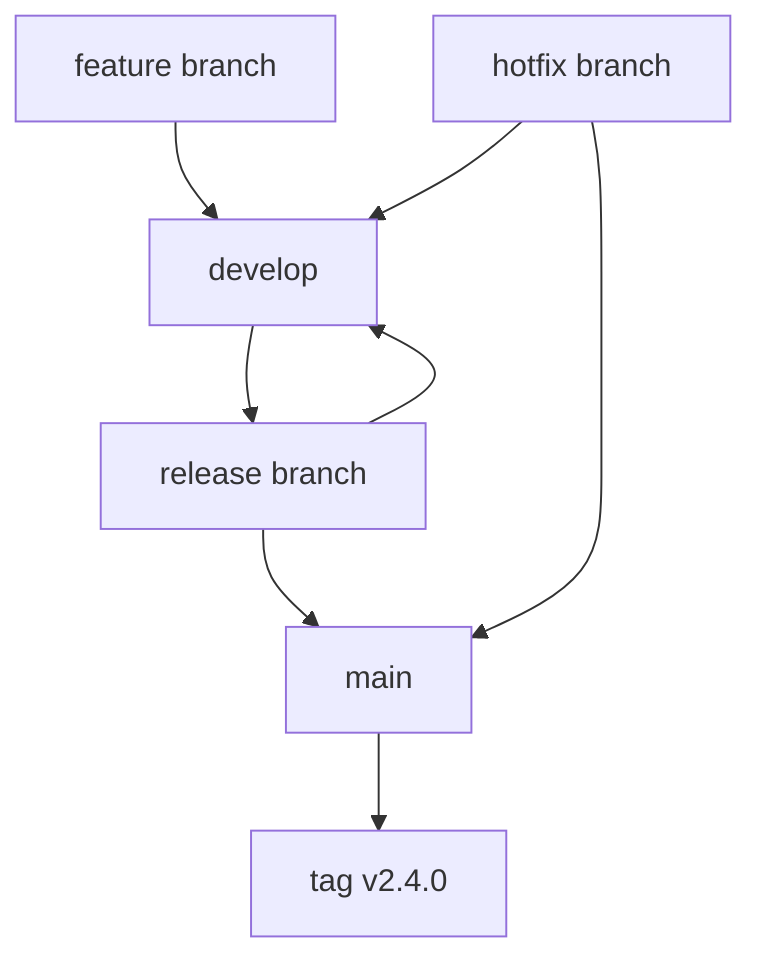
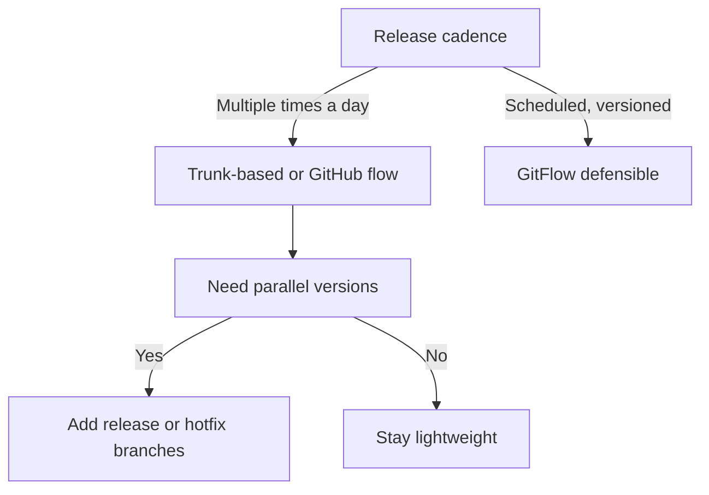

# Lecture 1 — Branching Strategies Compared

> **Duration:** ~2 hours. **Outcome:** You can explain how trunk-based development, GitHub flow, and GitFlow work, name what each one optimizes for, and choose the right one for a given team by reasoning about trade-offs rather than fashion.

A "branching strategy" is not a Git feature. It's a **team agreement**: where does new work live before it ships, how long does it live there, who is allowed to merge it, and how does it become a release. Git will happily let you do anything. The strategy is the discipline you layer on top so that many people can share one codebase without chaos.

There is no universally best strategy. The right one depends on three variables: **how often you release**, **how big the team is**, and **how expensive a bad release is**. This lecture teaches the three dominant strategies and — more importantly — the reasoning that picks between them.

## 1. Why the strategy matters more than the tool

Two teams can use the exact same Git and the exact same GitHub and have wildly different outcomes:

- **Team A** keeps a `develop` branch, a `release/2.4` branch, feature branches that live for three weeks, and a `main` that only the release manager touches. Merges are dramatic events with merge parties and conflict marathons.
- **Team B** merges tiny changes into `main` a dozen times a day, each behind a green CI check, and releases whatever is on `main` whenever they choose.

Same tools. The difference is *the agreement about how work flows*. The agreement determines how often you hit painful merge conflicts, how fast a fix reaches users, and how confidently you can roll back.

The single biggest driver of pain is **branch lifetime**. The longer a branch lives away from the mainline, the more the mainline drifts underneath it, and the worse the eventual merge. This is called **merge debt**, and it compounds like financial debt. Every strategy below is, at heart, a different answer to the question: *how do we keep branch lifetime short enough to avoid drowning in merge debt?*

## 2. Trunk-based development

**One shared branch — the trunk (usually `main`) — is the source of truth. Everyone integrates into it constantly**, at least once a day, ideally more. Branches, if they exist at all, live hours, not days.

How it works in practice:

```bash
# Morning: start from a fresh trunk
git switch main
git pull --ff-only

# Make a SMALL change on a short-lived branch
git switch -c add-retry-logic
# ... edit, commit ...
git push -u origin add-retry-logic
gh pr create --fill        # tiny PR, reviewed in minutes

# Merged behind green CI the same day; branch deleted
```

The defining rules:

- **Small changes.** A change that can't merge within a day is too big; break it up.
- **The trunk is always releasable.** CI is green on every commit to it.
- **Unfinished work hides behind feature flags**, not behind long branches. You merge code that is off by default, then flip the flag later.

Feature flags are what make trunk-based development possible for incomplete features. Instead of a three-week `checkout-redesign` branch, you merge the new checkout every day behind `if (flags.newCheckout)`, defaulting to off, and turn it on when it's ready:

```js
if (flags.newCheckout) {
  return renderNewCheckout();
}
return renderLegacyCheckout();
```

**Optimizes for:** integration frequency and release speed. Merge debt is near zero because nothing lives long enough to accrue it. It is the workflow behind continuous delivery.

**Costs:** requires real CI discipline (a red trunk blocks *everyone*), a feature-flag habit, and a culture of small changes. It is unforgiving of "I'll just merge this big thing and fix it later."

## 3. GitHub flow

A lightweight middle ground, and the default for most open-source and web-product teams. **`main` is always deployable. All work happens on short-lived branches that open a pull request, get reviewed and CI-checked, then merge back into `main`.** No `develop`, no release branches.

```bash
git switch main && git pull --ff-only
git switch -c fix-null-user
# ... commit ...
git push -u origin fix-null-user
gh pr create --fill
# review + green CI → "Squash and merge" → deploy main
```

The full loop is exactly six steps: branch off `main`, add commits, open a PR, discuss/review, merge, deploy. Branches typically live a few days at most.

**Optimizes for:** simplicity and a clean review checkpoint. It keeps the "always-deployable `main`" property of trunk-based dev but adds an explicit PR gate, which is why it fits teams with external contributors and formal review requirements.

**Costs:** branches can quietly grow long if PRs sit unreviewed, quietly reintroducing merge debt. It has no built-in answer for "we need to patch version 2.3 while 2.4 is in development" — for that you bolt on release branches or move toward GitFlow.

GitHub flow is best understood as **trunk-based development with a mandatory pull-request checkpoint and slightly longer branch lifetimes.**

## 4. GitFlow

The heavyweight, invented by Vincent Driessen in 2010 for software with **scheduled, versioned releases** — desktop apps, firmware, anything you can't hotfix instantly. It uses several long-lived branch types:

| Branch | Lives | Purpose |
|--------|-------|---------|
| `main` | forever | Production. Every commit is a tagged release. |
| `develop` | forever | Integration branch; the "next release" accumulates here. |
| `feature/*` | days–weeks | One per feature, branched from and merged to `develop`. |
| `release/*` | days | Stabilize a release: only bugfixes, version bumps, docs. |
| `hotfix/*` | hours | Emergency fix branched from `main`, merged to both `main` and `develop`. |

The flow: features merge into `develop`; when `develop` is "enough," you cut a `release/2.4` branch, stabilize it, then merge it into `main` (tag `v2.4.0`) *and* back into `develop`. Production emergencies get a `hotfix/*` off `main`.


*How features, releases, and hotfixes move through GitFlow's branch types.*

**Optimizes for:** managing **multiple versions in parallel** and a formal, gated release process. If you ship v2.3 to some customers and are building v2.4 for others, GitFlow's release and hotfix branches give you a clean place to do it.

**Costs:** it is the most complex, and its long-lived `feature/*` and `develop` branches are a merge-debt factory. Driessen himself later added a note that for **continuously delivered web apps, GitFlow is overkill** and simpler flows (GitHub flow / trunk-based) are better. Reaching for GitFlow on a web service you deploy ten times a day is a classic over-engineering smell.

## 5. Side-by-side

| Dimension | Trunk-based | GitHub flow | GitFlow |
|-----------|-------------|-------------|---------|
| Long-lived branches | `main` only | `main` only | `main` + `develop` (+release/hotfix) |
| Typical branch lifetime | hours | days | days–weeks |
| Merge-debt risk | very low | low–moderate | high |
| Release cadence it fits | continuous | continuous / on-demand | scheduled, versioned |
| Parallel released versions | hard (needs flags) | hard | native (release/hotfix) |
| Ceremony / overhead | low | low | high |
| Needs feature flags | yes | helpful | no |
| Best team size | any, scales to huge | small–medium | medium–large with release mgmt |
| CI discipline required | very high | high | moderate |

## 6. How to actually choose

Ask, in order:

1. **How often do you release?** Multiple times a day → trunk-based or GitHub flow. Every few weeks on a schedule → GitFlow is defensible.
2. **Do you support multiple versions at once?** If v1.x and v2.x both get patches → you need GitFlow-style release/hotfix branches, or a `release/*` overlay on GitHub flow.
3. **How mature is your CI and how scary is a rollback?** Strong CI + cheap rollback (a web deploy you can revert in a minute) → push toward trunk-based. Weak CI or expensive rollback (firmware, an app-store release) → a heavier gate like GitFlow buys you a stabilization window.
4. **How disciplined is the team about small changes and feature flags?** Trunk-based punishes teams that can't keep changes small. If you can't, start with GitHub flow and tighten toward trunk-based.


*The first two questions in choosing a branching strategy.*

A useful default: **most web and SaaS teams should run GitHub flow and drift toward trunk-based as their CI and flag discipline mature. Reach for GitFlow only when parallel versioned releases genuinely force it.** Choosing the heaviest process "to be safe" is a real cost, not free insurance.

## 7. Anti-patterns

- **"Long-lived feature branch."** A `feature/big-thing` alive for a month is merge debt with a countdown timer. Break it up or flag it.
- **GitFlow on a continuously deployed web app.** You inherit all the ceremony and none of the benefit; nobody is shipping v2.3 to a warehouse of appliances.
- **A `develop` branch that's really just a slower `main`.** If `develop` and `main` are always a rubber-stamp merge apart, `develop` is pure overhead — delete it and use GitHub flow.
- **Trunk-based with no CI.** Without a green-trunk gate, "everyone merges to main constantly" is just "everyone breaks main constantly."
- **Strategy by cargo cult.** "Google uses trunk-based" or "we always used GitFlow" is not a reason. The trade-offs are.

## 8. Self-check

- What single variable most drives merge pain, and how does each strategy control it?
- Which strategy natively supports patching an old released version while building the next one?
- Why does trunk-based development depend on feature flags?
- Give one concrete situation where GitFlow is the *right* choice, and one where it's over-engineering.
- Your team deploys a web app ~15 times a day with strong CI. Which strategy, and why?

If those are clear, Lecture 2 turns the strategy into enforced repo configuration — protection rules and ownership.

## Further reading

- **Trunk-Based Development** (Paul Hammant's canonical site): <https://trunkbaseddevelopment.com/>
- **"A successful Git branching model" — Vincent Driessen** (the original GitFlow post, with his later caveat): <https://nvie.com/posts/a-successful-git-branching-model/>
- **GitHub flow — official guide:** <https://docs.github.com/en/get-started/using-github/github-flow>
- **Martin Fowler, "Patterns for Managing Source Code Branches":** <https://martinfowler.com/articles/branching-patterns.html>
