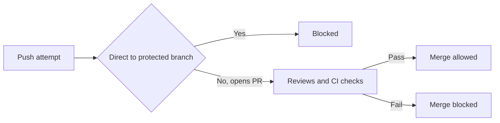
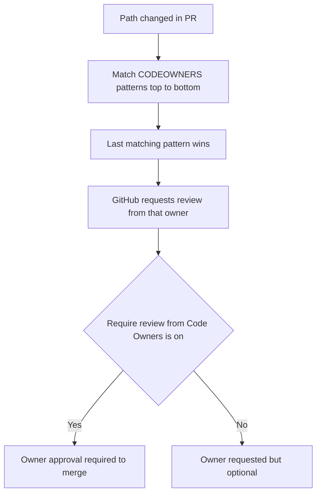

# Lecture 2 — Protected Branches, Ownership, and Repo Shape

> **Duration:** ~2 hours. **Outcome:** You can lock a branch so that nothing reaches it except through a reviewed, CI-checked pull request; you can auto-assign the right reviewers with a CODEOWNERS file; and you can reason about whether a team should live in one monorepo or many repos.

A branching strategy (Lecture 1) is a *promise*. Branch protection is how you make the promise **enforced by the platform instead of by hope.** Without protection, "we always review before merging to `main`" survives exactly until the first Friday-night hotfix pushed straight to the trunk. This lecture covers the rules that make the trunk un-break-able, the ownership file that routes reviews to the right humans, and the higher-level question of how many repositories the team should have at all.

## 1. What "protected" actually means

By default, anyone with write access can `git push` straight to `main` and force-push over history. A **protected branch** on GitHub replaces "can" with "can't, unless these conditions are met." Protection is configured per-branch (or per-pattern like `release/*`) in the repo's settings, or as an **organization ruleset** that applies across many repos at once.


*A protected branch turns a direct push into a gated pull-request path.*

The rules you'll actually use, and precisely what each one blocks:

| Rule | What it enforces |
|------|------------------|
| **Require a pull request before merging** | No direct pushes to the branch. Every change arrives via a PR. |
| **Require approvals** (N reviewers) | The PR needs ≥N approving reviews before the merge button lights up. |
| **Dismiss stale approvals on new commits** | Pushing more commits after approval re-opens review — no sneaking changes in post-approval. |
| **Require review from Code Owners** | If the PR touches an owned path, the owner *must* approve (see §3). |
| **Require status checks to pass** | Named CI checks must be green before merge (this is the Week 6 gate). |
| **Require branches to be up to date** | The PR branch must be rebased/merged onto the latest `main` before merging — CI ran against what will actually land. |
| **Require linear history** | Blocks merge commits; forces squash or rebase merges, keeping `main` a straight line. |
| **Require signed commits** | Every commit must carry a verified GPG/SSH/S/MIME signature. |
| **Require conversation resolution** | All PR review threads must be marked resolved before merge. |
| **Block force pushes** | Nobody can rewrite the protected branch's history. |
| **Restrict who can push** | Only named people/teams (or nobody) may merge, even after checks pass. |
| **Include administrators** | Applies every rule above to admins too — no bypass. Turn this ON for a real gate. |

The single most common mistake: setting up beautiful rules and leaving **"Include administrators" off**, so the two people most likely to panic-push in an incident are exactly the two who *can*. A gate with a hole in it is decoration.

## 2. Configuring protection

You can click through **Settings → Branches → Add rule**, but a workflow you can put in a runbook is scriptable. Via the GitHub CLI and REST API:

```bash
# Require a PR with 1 approval, code-owner review, one status check,
# up-to-date branches, and apply to admins too.
gh api -X PUT repos/:owner/:repo/branches/main/protection \
  --input - <<'JSON'
{
  "required_status_checks": {
    "strict": true,
    "contexts": ["ci / test"]
  },
  "enforce_admins": true,
  "required_pull_request_reviews": {
    "required_approving_review_count": 1,
    "require_code_owner_reviews": true,
    "dismiss_stale_reviews": true
  },
  "required_linear_history": true,
  "allow_force_pushes": false,
  "allow_deletions": false,
  "restrictions": null
}
JSON
```

`"strict": true` is the "require branches to be up to date" rule. `"restrictions": null` means "no push allow-list" (anyone who passes the other rules can merge); set it to a teams/users object to lock merging down further.

**Rulesets** (the newer, org-level system) do the same thing but can target many repos and multiple branch patterns from one place, with layered rules and a "bypass list" you manage explicitly. For a single repo, classic branch protection is fine; for an org with 40 repos that must all obey the same policy, reach for a ruleset.

Verify it's live:

```bash
gh api repos/:owner/:repo/branches/main/protection | jq '.enforce_admins.enabled'
```

## 3. CODEOWNERS — routing review to the right humans

A `CODEOWNERS` file maps **paths to owners**. When a PR changes a matching path, GitHub automatically requests a review from that owner, and — if "Require review from Code Owners" is on — that owner's approval becomes mandatory to merge. It is how a large codebase makes sure the database team sees database changes and the security team sees auth changes, without anyone remembering to add them.


*How a changed path resolves to a mandatory or optional reviewer.*

Put it at `.github/CODEOWNERS` (also valid at repo root or `docs/`). Syntax is gitignore-style patterns, each followed by one or more owners (users with `@name`, teams with `@org/team`, or emails):

```gitignore
# CODEOWNERS — last matching pattern wins, so order matters.

# Default owners for everything, unless a later line overrides.
*                       @acme/maintainers

# Frontend
/web/                   @acme/frontend
*.css                   @acme/design

# Backend services
/services/payments/     @acme/payments @alice
/services/auth/         @acme/security

# Anything touching CI or release config needs platform review
/.github/               @acme/platform
/CHANGELOG.md           @acme/release-managers
```

Critical rules that trip people up:

- **The last matching pattern wins**, not the most specific. If `*` is on line 1 and `/web/` is on line 5, a change under `/web/` is owned by the `/web/` owners *only*. Put general rules first, specific rules last.
- **Owners must have write access** to the repo, or GitHub silently ignores them.
- A pattern with **no owner** (just the path) explicitly *removes* ownership for that path — useful to carve out an un-owned exception.
- CODEOWNERS assigns reviewers; it does not by itself *require* them. The "Require review from Code Owners" branch-protection rule is what makes it a gate.

## 4. Reviews as a first-class rule

Approvals and CODEOWNERS combine into a review policy. Design it deliberately:

- **How many approvals?** One is standard for small teams. Two for high-risk areas (payments, auth, infra). More than two is usually a bottleneck disguised as safety.
- **Code-owner approval required?** Yes for anything with a clear owning team; it prevents "someone approved it but nobody who understands this subsystem looked."
- **Dismiss stale approvals?** Yes on a real gate — otherwise a PR gets approved at commit A and merges at commit F.
- **Require conversation resolution?** Yes; it stops "I left a blocking comment and they merged anyway."

The goal is a policy strict enough that the green merge button *means something* — reviewed by a human who owns the code, checked by CI, against the current trunk — without so much ceremony that people route around it.

## 5. Monorepo vs multi-repo

Zoom out from one branch to the whole team's code. Two shapes:

- **Monorepo:** one repository holds many projects/services/packages. Google, Meta, and many large companies run enormous monorepos.
- **Multi-repo (polyrepo):** each service/library gets its own repository, versioned and released independently.

| Dimension | Monorepo | Multi-repo |
|-----------|----------|------------|
| Atomic cross-project changes | one PR changes API + all callers | needs coordinated PRs across repos |
| Code sharing / refactors | trivial, everything visible | version-bump dance across repos |
| CODEOWNERS granularity | one file, per-directory owners | one file per repo, simple |
| CI cost | must scope builds to changed paths, or every push builds everything | naturally scoped per repo |
| Access control | coarse (repo-level) unless you add tooling | fine (per repo) out of the box |
| Independent release cadence | harder — shared trunk | native — each repo tags itself |
| Tooling maturity needed | high (build graphs, sparse checkout) | low |
| Clone / checkout size | can get huge | small |

The honest summary: **a monorepo trades tooling investment for coordination ease.** It makes cross-cutting changes and refactors wonderful and makes CI, access control, and scale into engineering problems you must actively solve (path-filtered CI, `CODEOWNERS` per directory, build tools like Bazel/Nx/Turborepo, sparse/partial checkout). Multi-repo gives you clean isolation and independent release cadences for free, at the cost of painful cross-repo changes and version-coordination overhead.

Choose a monorepo when teams share a lot of code and change it together, and you can invest in build tooling. Choose multi-repo when services are genuinely independent, owned by separate teams, and released on their own schedules. Neither is "modern" or "legacy" — they're different trade-offs, and plenty of strong teams run each.

In a monorepo, protection and ownership do more work: path-scoped CI (only run the payments tests when `/services/payments/` changes), a well-factored `CODEOWNERS`, and per-directory review rules are what keep one giant repo from becoming one giant bottleneck.

## 6. Putting it together

A realistic small-team baseline for a single service repo:

- Strategy: GitHub flow, `main` always deployable (Lecture 1).
- `main` protected: require PR, 1 approval, code-owner review, `ci / test` status check green, strict (up-to-date) branches, linear history, dismiss stale approvals, **include administrators**.
- `.github/CODEOWNERS` with sane defaults and a couple of high-risk carve-outs (auth, CI/release config need extra owners).
- Force-push and deletion of `main` blocked.

That configuration is the difference between "we have rules" and "the rules are real."

## 7. Self-check

- Name three things "require a pull request before merging" alone does **not** guarantee, and which extra rules add them.
- Why is "Include administrators" the rule people most often forget, and what does forgetting it cost?
- In CODEOWNERS, which pattern wins when two match — most specific or last listed?
- Give one change type that is trivial in a monorepo and painful in multi-repo, and one that's the reverse.
- What extra CI concern does a monorepo create that a small multi-repo setup doesn't?

If those are solid, Lecture 3 turns a protected, reviewed trunk into an automated, versioned release process.

## Further reading

- **GitHub — About protected branches:** <https://docs.github.com/en/repositories/configuring-branches-and-merges-in-your-repository/managing-protected-branches/about-protected-branches>
- **GitHub — About code owners:** <https://docs.github.com/en/repositories/managing-your-repositorys-settings-and-features/customizing-your-repository/about-code-owners>
- **GitHub — About rulesets:** <https://docs.github.com/en/repositories/configuring-branches-and-merges-in-your-repository/managing-rulesets/about-rulesets>
- **"Monorepos: Please don't" and the rebuttals** — read a pro and a con; start with the monorepo.tools overview: <https://monorepo.tools/>
